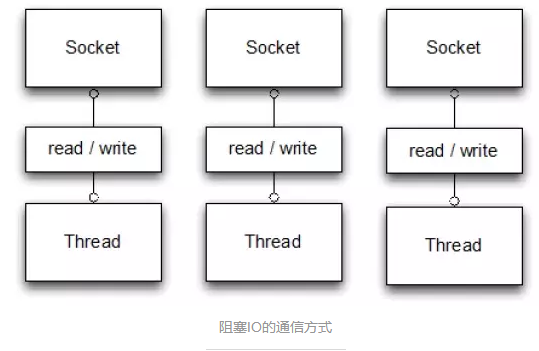
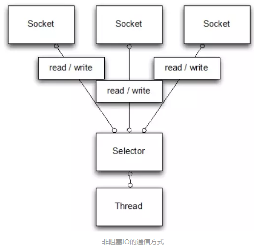
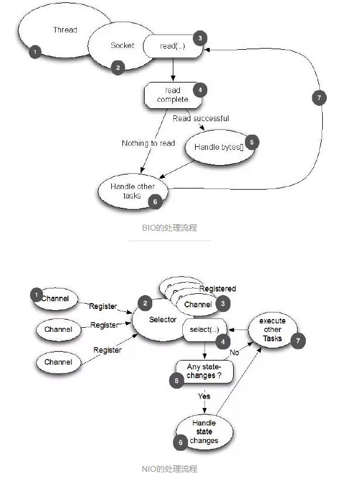
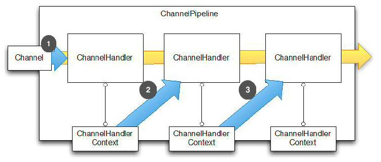
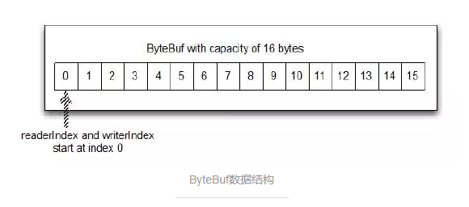
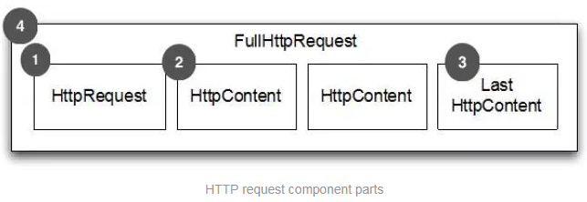
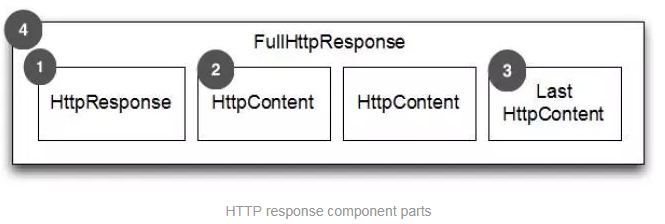
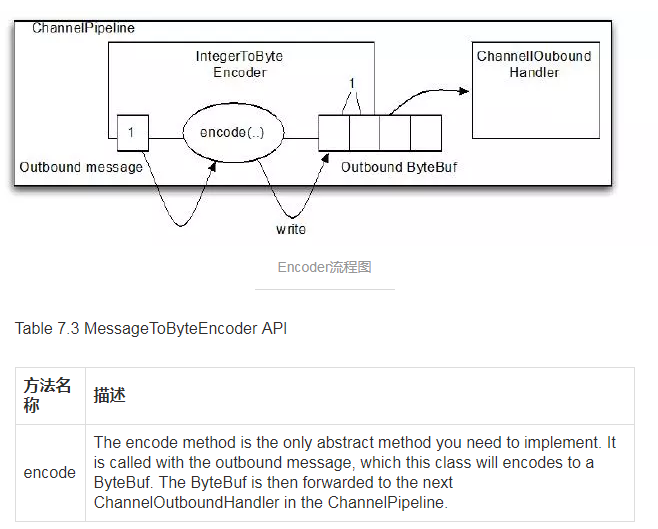
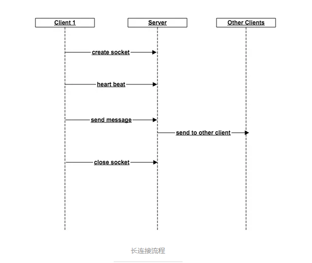

### [Netty相关](https://waylau.gitbooks.io/essential-netty-in-action/content/GETTING%20STARTED/Asynchronous%20and%20Event%20Driven.html)

1. [Netty高性能](https://www.cnblogs.com/wxd0108/p/5635504.html)
```text
Netty 是一个利用Java的高级网络的能力，隐藏起背后的复杂性而提供一个易于使用的API的客户端/服务器框架。
Netty是一个广泛使用的Java网络编程框架(Netty在2011年获得了Duke's Choice Award，见https://www.java.net/dukeschoice/2011)。它活跃和成长与用户社区，向大型公司Facebook和Instagram以及刘慈宁宫开源项目如Infinispan,HornetQ,Vert.x,Apache Cassandra和Elasticsearch等，都利用其强大的对于网络抽象的核心代码。                                           
```
* [《Essential Netty In Action》](https://waylau.gitbooks.io/essential-netty-in-action/content/GETTING%20STARTED/Asynchronous%20and%20Event%20Driven.html)

* Netty和Tomcat区别？
> 最大区别在于通信协议。Tomcat是基于HTTP协议的，它实质是一个基于HTTP协议的web容器，但Netty不一样，它能通过编程自定义各种协议，因为Netty能够通过codec自己来编码/解码字节流，完成类似redis访问的功能，这就是netty和Tomcat的最大不同。
>> IO BIO NIO AIO  zero-copy

* Netty优点
> 并发高  传输快 封装好

#### 并发高
> Netty是一款基于NIO(Nonblocking I/O，非阻塞IO)开发的网络通信框架，对比与BIO(Blocking I/O,阻塞IO)，并发性能得到很大提高.
>> Netty 中Selector中接收客户端发过来的全部数据然后将服务端处理完请求业务之后返回response给客户端。NIO与BIO的主要区别在接收客户端发过来的数据。BIO中等待客户端发数据这个过程是阻塞的，这样造成一个线程只能处理一个请求。NIO中，当一个Socket建立好之后，Thread并不会阻塞去接收这个Socket，而是将这个请求交给Selector，Selector会不断的便利所有的Socket，一旦有一个Socket建立完成，就会通知Thread，然后Thread处理完数据后在返回给客户端--这个过程是不足赛的，这样就能让一个Thread处理更多的请求。




* 其他IO

|IO | message | 场景| 
|----|--------|-----|
|BIO|同步阻塞IO，阻塞整个步骤，如果连接少，其延迟最低，因为一个线程只处理一个连接|适用于连接少且延迟低的场景 如数据库连接|
|NIO|同步非阻塞IO，阻塞业务处理但不阻塞数据接收|适用于高并发且处理简单的场景 如聊天软件|
|多路复用IO|两个步骤处理是分开的，即一个连接可能他的数据接收是线程A完成的。数据处理是线程B完成的，比BIO能处理更多请求||
|信号驱动IO|主要用在嵌入式||
|异步IO|数据请求和数据处理都是异步的，数据请求一次返回一次|适用于长连接的业务场景|
[以上信息来源于【Linux IO模式及 select、poll、epoll详解】](https://segmentfault.com/a/1190000003063859)

#### 传输快
* Netty 传输快依赖了NIO的一个特性-zero-copy。
> Netty在需要接受数据时会在堆内存之外开辟一块内存，数据直接从IO读到那块内存中去，在netty里面通过ByteBuf可以直接对这些数据进行直接操作，从而加快了传输速度.ByteBuf是Netty数据处理的容器，也是Netty封装好的一个重要体现。

#### 封装好
* 阻塞IO
```java
public class PlainBioServer {
    public void server(int port) throws IOException {
        final ServerSocket socket = new ServerSocket(port);
        try {
            for (;;) {
                final Socket clientSocket = socket.accept();
                System.out.println("Accepted connection from " + clientSocket);
                
                new Thread(()->{
                    OutputStream out;
                    try {
                        out = clientSocket.getOutputStream();
                        out.write("Hi!\r\n".getBytes(Charset.forName("UTF-8")));
                        out.flush();
                        clientSocket.close();
                    } catch(IOException e) {
                        e.printStackTrace();
                        try{
                            clientSocket.close();
                        } catch(IOException ex) {
                            // ignore on close
                        }
                    }
                }).start();
            }
        } catch (IOException e) {
            e.printStackTrace();
        }
    }
}
```
* 非阻塞IO
```java
public class PlainNioServer {
    public void server(int port) throws IOException {
        ServerSocketChannel serverChannel = ServerSocketChannel.open();
        serverChannel.configureBlocking(false);
        ServerSocket ss = serverChannel.socket();
        InetSocketAddress address = new InetSocketAddress(port);
        ss.bind(address);
        Selector selector = Selector.open();
        serverChannel.registry(selector, SelectionKey.OP_ACCEPT);
        final ByteBuffer msg = ByteBuffer.wrap("Hi!\r\n".getBytes());
        for (;;){
            try {
                selector.select();                
            }catch(IOException ex) {
                ex.printStackTrace();
                // handle exception
                break;
            }
            Set<SelectionKey> readyKeys = selector.selectedKeys();
            Iterator<SelectionKey> iterator = readyKeys.iteratpr();
            while(iterator.hasNext()) {
                SelectionKey key = iterator.next();
                iterator.remove();
                try {
                    if (key.isAcceptable()) {
                        ServerSocketChannel server = (ServerSocketChannel)key.channel();
                        SocketChannel client = server.accept();
                        client.configureBlocking(false);
                        client.register(selector, SelectionKey.OP_WRITE | SelectionKey.OP_READ, msg.duplicate());
                        System.out.println("Accepted connection from " + client);
                    }
                    if (key.isWritable()) {
                        SocketChannel client = (SocketChannel)key.channel();
                        ByteBuffer buffer = (ByteBuffer)key.attachment();
                        while( buffer.hasRemaining()) {
                            if (client.write(buffer) == 0) {
                                break;
                            }
                        }
                        client.close();
                    }
                } catch (IOException ex) {
                    key.cancel();
                    try{
                        key.channel.close();
                    } catch(IOException cex) {
                        // 在关闭时忽略
                    }
                }
            }
        }
    }
}
```
* Netty
```java
public class NettyOioServer {
    public void server(int port) throws Exception {
        ByteBuffer buf = Unpooled.unreleasableBuffer(Unpooled.copiedBufer("Hi!\r\n", Charset.fprName("UTF-8")));
        EventLoopGroup group = new OioEventLoopGroup();
        try{
            ServerBootstrap b = new ServerBootstrap();
            b.group(group)
            .channel(OioServerSocketChannel.class)
            .localAddress(new InetSocketAddress(port))
            .childHandler(new ChannelInitializer<SocketChannel>(){
                @Override
                public void initChannel(SocketChannel ch) throws Exception {
                    ch.pipeline().addLast(new ChannelInboundHandlerAdapter() {
                        @Override
                        public void channelActive(ChannelHandlerContext ctx) throws Exception {
                            ctx.writeAndFlush(buf.duplicate()).addListener(ChannelFutureListener.CLOSE);
                        }
                    });
                }
            });
            ChannelFuture f = b.bind.sync();
            f.channel.closeFuture.sync();
        } finally {
            group.shutdownGracefully().sync();
        }
    }
}
```

* Channel 
> 数据传输流，与channel相关的概念有以下四个

> * Channel: 表示一个连接，可以理解为每个请求就是一个Channel
> * ChannelHandler: 核心处理业务就在这里，用于处理业务请求
> * ChannelHandlerContext: 用于传输业务数据
> *  ChannelPipeline: 用于保存处理过程需要用到的ChannelHandler和ChannelHandlerContext

* ByteBuf
> ByteBuf是一个存储字节的容器，最大特点就是使用方便，既有自己的读索引和写索引，方便堆整段字节缓存进行读写，也支持get/set，方便对其中每一个字节进行读写，数据结构如下图所示：

> 有三种使用模式
> * Heap Buffer:堆缓冲区：是ByteBuf最常用的模式，将数据存储在堆空间
> * Direct Buffer 直接缓冲区：直接缓冲区是ByteBuf的另外一种常用模式，其内存分配都不发生在堆，jdk1.4引入的NIO的ByteBuffer类允许JVM通过本地方法调用分配内存，这样做有两个好处：
>> * 通过免去中间交换的内存拷贝，提升IO处理速度；直接缓冲区的内容可以驻留在垃圾回收扫描的堆区以外。
>> * DirectBuffer在-XX:MaxDirectMemorySize=xxM大小限制下，使用Heap之外的内存，GC对此“无能为力”，也就意味着规避了在高负载下频繁的GC过程堆应用线程的中断影响。
> * Composite Buffer复合缓冲区：相当于多个不同ByteBuf的视图，这是netty提供的，jdk不提供这样的功能

* Codec
> Netty中的编码/解码器，通过这个能完成字节与pojo、pojo与pojo的相互转换，从而达到自定义协议的目的。
>> Netty中最有名的的就是HTTPRequestDecoder和HttpResponseEncoder


* HTTP请求
> * HttpRequest:

> 1、HTTP Request 第一部分是包含的头部信息<p>2、HTTPContent里面包含的是数据，可以后续有多个HttpContent部分<p>3、LastHttpContent标记是HTTP request的结束，同时可能包含头的尾部信息。完整的Http Request由1、2、3组成

> * HttpResponse:

> 1、Http Response第一部分是包含的头信息<p> 2、HTTPContent里面包含的是数据，可以后续有多个HTTPContent部分<p> 3、LastHTTPContent标记是Http response的结束，同时可能包含头的尾部信息。完整的HTTP response由1、2、3组成

> 从request介绍可以看出，一次HTTP请求并不是通过一次对话完成的，它中间可能有很多次的连接。通过前面对Netty的了解，每一次对话都会建立一个channel，并且一个ChannelInboundHandler一般是不会同时去处理多个Channel的。如何在一个Channel里面处理一次完成的Http请求？ 根据上图我们只需要在使用Netty处理channel的时候，只处理消息是HTTPRequest的channel，这样就能在一个ChannelHandler中处理一个完整的Http请求。

>> 查看netty-demo中的server代码

#### 构建HTTPS服务
> 首先构建HTTPS服务需要SSL证书
```text
SSL 证书就是遵守SSL协议，由受信任的数字证书颁发机构CA，在验证服务器身份后颁发，具有服务器身份验证和数据传输加密功能。
也就是说，HTTPS相比于HTTP服务，能够防止网络劫持，同时具备一定的安全加密作用。
一般来说，证书可以在阿里云、腾讯云这种云服务上申请。申请下来之后证书只能用于指定的域名和服务器上。
```
> Netty 有提供SSL加密的工具包，只需要通过添加SslHandler,就能快速搭建。基于上面的代码，重新定义一个ChannelInitializer
>> SSLChannelInitializer这个类在Netty Server中有什么用处呢？

#### Decoder AND Encoder
* Netty中的四个核心概念
 > * Channel: 一个客户端与服务器通信的通道
 > * ChannelHandler: 业务处理器，分为ChannelInboundHandler和ChannelOutboundHandler
 >> * ChannelInboundHandler: 输入数据处理器
 >> * ChannelOutboundHandler: 输出业务处理器
 > * ChannelHandlerContext: 通信管道的上下文
 > * ChannelPipeline: 用于存放ChannelHandler的容器


> * 这四个工具交互流程：
>> * 事件传递给ChannelPipeline的第一个ChannelHandler
>> * ChannelHandler通过关联的ChannelHandlerContext传递事件给ChannelPipeline中的下一个ChannelHandler

>> 而Decoder和Encoder分别是ChannelOutboundHandler和ChannelInboundHandler在数据流进来的时候将字节码转换为消息对象和数据流初期的时候将消息对象转换为字节码。 

* Encoder
> Encoder最重要的实现类是MessageToByteEncoder<T>,这个类的作用就是将消息实体T从对象转换成byte，写入到ByteBuf，然后再丢给剩下的ChannelOutboundHandler传给客户端。流程如下：

encode方法是继承MessageToByteEncoder<T>唯一小重写的方法：
```java
public class ShortToByteEncoder extends
        MessageToByteEncoder<Short> {  //1
    @Override
    public void encode(ChannelHandlerContext ctx, Short msg, ByteBuf out)
            throws Exception {
        out.writeShort(msg);  //2
    }
}
```

* Decoder
> decoder是在服务端收到数据的时候，将字节流转换为实例对象Message。但是和Encoder处理逻辑不一样，数据传到服务端有可能不是一次请求就能完成，中间可能需要经过几次数据传输，并且每一次传输传多少数据也不是确定的，所以它有两个重要方法：

Table 7.1 ByteToMessageDecoder API

|方法名称|描述|
|--------|-----|
|decode| This is the only abstract method you need to implement. It is called with a ByteBuf having the incoming bytes and a List into which decoded messages are added. decode() is called repeatedly until the List is empty on return. The contents of the List are then passed to the next handler in the pipeline. |
|decodeLast|The default implementation provided simply calls decode(). This method is called once, when the Channel goes inactive. Override to provide special|

decode与decodeLast方法的不同之处在于decodeLast只有在Channel的生命周期结束之前会调用一次，默认是调用decode方法。
```java
public class ToIntegerDecoder extends ByteToMessageDecoder {  //1

    @Override
    public void decode(ChannelHandlerContext ctx, ByteBuf in, List<Object> out)
            throws Exception {
        if (in.readableBytes() >= 4) {  //2
            out.add(in.readInt());  //3
        }
    }
}
```
> 从这段代码中可以看出，由于不知道这次请求发过来多少数据，所以每次都要判断byte长度，如果数据长度更长且不固定的话，这里的逻辑会变得非常复杂。下面介绍另一个常用的解码器：ReplayingDecoder

* ReplayingDecoder
> ReplayingDecoder是byte-to-messge解码的一种特殊的抽象基类，读取缓冲区的数据之前需要检查缓冲区是否有足够的字节，使用ReplayingDecode人就无需自己检查；若ByteBuf中有足够的字节则会正常读取，否则会停止解码。
>> 在使用的时候需要理解两个方法checkpoint(S s)和state(),其中checkpoint的参数S代表的是ReplayingDecoder所处的状态，一般是枚举类型，ReplayingDecoder是一个有状态的Handler，状态表示的是它目前读取到了哪一步，checkpoint(S s)是设置当前的状态，state()是获取当前的状态。

> 下面模拟一个简单的Decoder，假设每个包包含length:int和content:String两个数据，其中length可以为0，代表一个空包，大于0代表content的长度，代码如下：
```java
public class LiveDecoder extends ReplayingDecoder<LiveDecoder.LiveState> {
    public enum LiveState {
        LEHGTH,
        CONTENT
    }
    
    private LiveMessage message = new LiveMessage();
    public LiveDecoder() {
        super(LiveState.LENGTH);
    }
    
    @Override
    protected void decode(ChannelHandlerContext channelHandlerContext, ByteBUf byteBuf, List<Object> list) throws Exception {
        switch (state()) {
            case LENGTH:
                int length = byteBuf.readInt();
                if (length > 0) {
                    checkpoint(LiveState.CONTENT);
                } else {
                    list.add(message);
                }
                break;
            case CONTENT:
                byte[] bytes = new byte[message.getLength()];
                byteBuf.readBtes(bytes);
                String content = new String(bytes);
                message.setContent(content);
                list.add(message);
                break;
            default: 
                throw new IllegalStateException("invalid state:" + state());
        }
    } 
}
```
>> * 继承ReplayingDecoder，泛型LiveState，用来表示当前读取的状态
>> * 描述LiveState，有读取长度和读取内容两个状态
>> * 初始化的时候设置为读取长度的状态
>> * 读取的时候通过state()方法来确定当前处于什么状态
>> * 如果读取出来的长度大于0，则设置为读取内容状态，下异地读取的时候则从这个位置开始
>> * 读取完成，往结果里面放解析好的数据

>> 以上就是ReplayingDecoder的使用方法，它比ByteToMessageDecoder更加灵活，能够通过巧妙的方式来处理复杂的业务逻辑，但是也是这个原因使得ReplayingDecoder带有一定的局限性：
>> * 不是所有的标准ByteBuf操作都被支持，如果调用一个不支持的操作会抛出UnreplayableOperationException
>> * ReplayingDecoder略鳗鱼ByteToMessageDecoder。
>所以，如果不引入过多的复杂性，使用ByteToMessageDecoder，否则使用ReplayingDecoder。 

* MessageToMessage
> Encoder和Decoder除了能完成Byte和Message的相互转换只亲爱，还能完成Message和Message的相互转换。Http协议就用到了这种MessageToMessage的派生类

#### Netty实现长连接
> 长连接流程

> * 创建连接(channel)
> * 发心跳包
> * 发消息，并通知其他用户
> * 约定时间没收到心跳包或者用户主动关闭之后关闭连接

* 这步骤中有两个难点
> * 如何保存已经创建的Channel
>> 如果是单机的话，可以根据对象hashCode存放到map中，如果是分布式系统，可以试试将数据存储到第三方(理论上可以)
> * 如何自动关闭没有心跳的连接
>> Netty有一个比较好的feature，就是ScheduledFuture，可以通过ChannelHandlerContext.executor().schedule()创建，支持延时提交，也支持取消任务，这就给心跳包的自动关闭提供了较好的实现方案。(怎么实现？)

* 实现长连接
> 通过一个JavaBean来封装通信的协议内容，在这里主需要三个数据就行了
> * type:byte,消息的类型，有心跳类型和内容类型
> * length:int 消息的长度
> * content:String 消息的内容(心跳包在这里没有内容)
>> 然后需要将Channel和ScheduledFuture缓存到Map里面，需要将两个对象组合成一个JavaBean。接着需要完成输入输出流的解析和转换。


* release address
> * [一](https://www.jianshu.com/p/b9f3f6a16911)
> * [二](https://www.jianshu.com/p/ed0177a9b2e3)
> * [三](https://www.jianshu.com/p/fd815bd437cd)
> * [四]()

> *[Netty官网](https://netty.io/)
