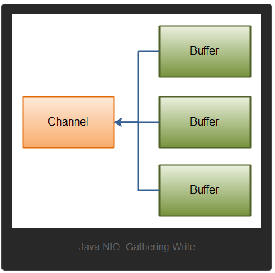

### JAVA NIO

> Java NIO由以下几个核心部分组成：
> * Channels
> * Buffers
> * Selectors
>> 除此之外还有很多类和组件，但是Channel、Buffer和Selector构成了核心的API。其他组件如Pipe和FileLock只不过是与三个核心组件共同使用的工具类。
#### Channel 和 Buffer
> 基本上所有的IO在NIO中都从一个Channel开始。Channel有点像流。数据可以从Channel读到Buffer中，也可以从Buffer写到Channel中。如下图：

> 以下是Java NIO中一些主要的Channel的实现:
> * FileChannel：从文件中读写数据
> * DatagramChannel：通过UDP读写网络中的数据
> * SocketChannel：通过TCO读写网络中的数据
> * ServerSocketChannel：可以监听新进来的TCP连接，像web服务器一样。堆每个新进来的连接都会创建一个SocketChannel。
>> 这些通道涵盖了UDP和TCP网络IO以及文件IO

> 以下是Java NIO里关键的Buffer实现：
> * ByteBuffer
> * CharBuffer
> * DoubleBuffer
> * FloatBuffer
> * IntBuffer
> * LongBuffer
> * ShortBuffer
> * MappedByteBuffer
>> 这些Buffer覆盖了通过IO发送的基本数据类型: byte、short、int、long、float、double和char。此外Java NIO还有一个MappedByteBuffer

* Channel
> Java NIO的通道类似流，但又有些不同:
> * 既可以从同道中读取数据，又可以写数据到通道。但流的读写通常是单向的
> * 通道可以异步的读写
> * 通道中的数据总是要先读到一个Buffer，或者总是要从一个Buffer中写入
>> 基本的Channel示例:com.example.netty.center.nio.channel.FileChannelTest

* Buffer
> Java NIO中的Buffer用于和NIO通道进行交互。如数据是从通道读入缓冲区，从缓冲区写入到通道中的。<p>
> 缓冲区本质上是一块可以写入数据、然后可以从中读取数据的内存。这块内存被包装成NIO Buffer对象，并提供了一组方法用来方便的访问该内存块。
> * Buffer基本用法
>> * 使用Buffer读写数据一般遵循以下四个步骤
>> 1、写入数据到Buffer<p>
>> 2、调用flip()方法<p>
>> 3、从Buffer中读取数据<p>
>> 4、调用clear()方法或者compact()方法<p>
>> 当像Buffer写入数据时，Buffer会记录下写入了多少数据。一旦要读取数据，需要通过flip()方法将Buffer从写模式切换到读模式。在读模式下可以读取之前写入到Buffer中的所有数据<p>
一旦读完了所有的数据，就需要清空缓存区，让它可以再次被写入。有两种方式能清空缓冲区：调用clear()或compact()方法。clear()方法或清空整个缓冲区。compact()方法只会清除已读过的数据。任何未读的数据都被移动到缓冲区的起始处，新写入的数据将放到缓冲区维度数据的后面。
> 一个简单使用Buffer例子:com.example.netty.center.nio.channel.FileChannelTest

* Buffer的capacity、position和limit
> 缓冲区本质是一块可以写入数据然后可以从中读取数据的内存。这块内存被包装成NIO Buffer对象，并提供了一组方法用来方便访问该快内存。
> * Buffer的三个属性:
>> * capacity: 作为一个内存块，Buffer有一个固定的大小值，也叫“capacity”，只能王丽写capacity个byte、long、char等类型，一旦Buffer满了，就需要将其清空(通过读数据或者清除数据)才能继续写入数据。
>> * position: 当写入数据到Buffer中时，position表示当前位置。初始的position值为0，当一个byte、long等数据写到Buffer之后，position会前移动到下一个可插入数据的Buffer单元。破四庭最大可为capacity-1.<p> 当读取数据时，也是从某个特定位置读。当将Buffer从写模式切换到读模式position会被重置为0.当从Buffer的position处读取数据时，position向前移动到下一个可读位置。
>> * limit: 在写模式下，Buffer的limit表示你最多能往Buffer里写多少数据。写模式下limit等于Buffer的capacity。<p>当切换Buffer到读模式是，limit表示你最多鞥读到多少数据。因此，当切换Buffer到读模式时，limit会被设置成写模式下的position值。即能读到之前写入的所有数据。

> position和limit的含义取决于Buffer处在度模式还是写模式，下面是一个详细的插图


* Buffer的分配
> 想要获得一个Buffer对象首先要进行分配。每一个Buffer类都有一个allocate方法。下面是一个分配48字节capacity的ByteBuffer的例子
```java
ByteBuffer buf = ByteBuffer.allocate(48);
// 或者分配一个可以存储1024个字符的CharBuffer
CharBuffer buf = CharBuffer.allocate(1024);
```
* 向Buffer中写数据
> 写数据到Buffer有两种方式:
> * 从Channel写到Buffer
```java
int bytesRead = inChannel.read(buf);  // read into buffer
```
> * 通过Buffer的put()方法写到Buffer
```java
buf.put(127);
```
> put()方法有很多版本，允许你以不同的方式把数据写入到Buffer中。例如，写到一个指定位置，或者把一个字节数组写入到Buffer。更多Buffer实现细节参考JavaDoc

* filp()方法
> flip()方法将Buffer从写模式切换到读模式。调用flip()方法会将position设回0并将limit设置成之前破斯通的值。也就是说position现在用于标记读的位置，limit表示之前写入了多少个byte、char等--现在能读取多少个byte、char等。

* 从Buffer中读取数据
> 从Buffer中读取数据有两种方式：
> * 从Buffer读取数据到Channel
```java
// read from buffer into channel
int bytesWritten = inChannel.write(buf);
```
> * 使用get()方法从Buffer中读取数据
```java
byte aByte = buf.get();
```
> get()方法有很多版本，允许以不同方式从Buffer中读取数据。例如从指定position读取或者从Buffer中读取数据到字节数组。更多Buffer实现的细节参考JavaDoc。

* rewind()方法
> Buffer.rewind()将position设置回0，所以可以重读Buffer中的所有数据。limit保持不变，表示仍能从Buffer中读取多少个元素(byte、char等)

* clear()与compact()方法
> 读完Buffer中的数据，需要让Buffer准备好再次被写入。可以通过clear()或compact()方法来完成。<p>如果调用的是clear()方法，position将被设置回0，limit被设置成capacity。意味着Buffer被清空了，但数据并未清除，只是这些标记示意可以从哪里开始往Buffer里写数据。如果Buffer中有一些未读的数据，调用clear()方法后，数据将"被遗忘”,意味着不再有任何标记会告诉你哪些数据被读过，哪些还没有。<p>如果Buffer中仍有数据未读，且后续还需要这些数据，但是此时想要先写些数据，那么使用compact()方法。compact()方法将所有未读的数据拷贝到Buffer起始处，然后将position设置到最后一个未读元素正后面。limit属性依然向clear()方法一样，设置成capacity。现在Buffer准备好写数据了，但是不会覆盖未读数据。

* mark()与reset()方法
> 通过调用Buffer.mark()方法可以标记Buffer中的一个特定position。之后可以通过Buffer.reset()方法恢复到这个position。
```java
buffer.mark;
// call buffer.get a couple of times,e.g. during parsing.
buffer.reset();  // set position back to mark
```

* equals()与compareTo()方法
> * equals()
>> 当满足下列条件时，标书两个Buffer相等
>> * 有相同的类型(byte char int等)
>> * Buffer中剩余的byte、char等的个数相等
>> * Buffer中所有剩余的byte、char等都相同
> equals()只是比较Buffer的一部分，不是每一个在它里面的元素都比较，实际上只比较Buffer中的剩余元素

> * compareTo()
>> compareTo()方法比较两个Buffer的剩余元素(byte char等)，如果满足下列条件，则认为是一个Buffer"小于"另一个Buffer：
>> * 第一个不相等的元素小于另一个Buffer中对应的元素
>> * 所有元素都相等，但第一个Buffer比另一个先耗尽(第一个Buffer的元素个数比另一个少)。  

> * 剩余元素是指从position到limit之间的元素

###### Scatter/Gather
> Java NIO开始支持scatter/gather,scatter/gather用于描述从Channel中读取或者写入到Channel的操作。<p>分散(scatter)从Channel中读取是指在读操作时将读取的数据写入多个buffer中。因此，Channel将从Channel中读取的数据"分散(scatter)"到多个Buffer中。<p> 聚集(gather)写入Channel是指在写操作时将多个buffer的数据写入同一个Channel，因此Channel将多个Buffer中的数据"聚集(gather)"后发送到Channel。<p>scatter、gather经常用于需要将传输的数据分开处理的场合，例如传输一个由消息头和消息体组成的消息，可能会将消息头和消息体分散到不同的buffer中，这样可以方便处理消息头和消息体。
* Scattering Reads
> Scattering Reads是指数据从一个channel读取到多个Buffer中，如下图：

```java
ByteBuffer header = ByteBuffer.allocate(128);
ByteBuffer body = ByteBuffer,allocate(1024);
ByteBuffer[] bufferArray = {header, body};
channel.read(bufferArray);
```
> buffer首先被插入到数组，然后再将数组作为channel.read()的输入参数。read()方法按照buffer在数组中的顺序将从channel中读取的数据写入到buffer，当一个buffer被写满后，channel紧接着像另一个buffer中写.<p>Scattering Reads在移动下一个buffer前，必须填满当前的buffer，这也意味着它不适用于动态消息(即消息大小不固定)。换句话说， 如果存在下溪头和消息体，消息头必须完成填充(固定长度大小)，Scattering Reads才能正常工作。
* Gathering Writes
> Gathering Writes是指数据从多个buffer写入到同一个channel中，如下图：

```java
ByteBuffer header = ByteBuffer.allocate(128);
ByteBuffer body = ByteBufer.allocate(1024);
// write data into buffers
ByteBuffer[] bufferArray = {header, body};
channel.write(bufferArray);
```
> buffers数组是write()方法的入参，write()方法会按照buffer在数组中的顺序，将数据写入到channel，注意只有position和limit之间的数据才会被写入。因此如果一个buffer的容量为128byte，但是仅仅包含58byte的数据，那么这58byte的数据将会被写入到channel中。因此与Scattering Reads相反，Gathering Writes能较好的处理动态消息。

###### 通道之间的数据传输
> 如果两个通道中有一个FileChannel，那么可以直接将数据从一个channel传输到另一个channel。
* transferFrom()
> FileChannel的transferFrom()方法可以将数据从源通道传输到FileChannel中(这个方法在JDK文档中的解释为将字节从给定的可读取字节通道传输到此通道的文件中)
```java
RandomAccessFile fromFile = new RandomAccessFile("fromFile.txt", "rw");
FileChannel fromChannel = fromFile.getChannel();

RandomAccessFile toFile = new RandomAccessFile("toFile.txt", "rw");
FileChannel toChannel = toFile.getChannel();
long position = 0;
long count = fromChannel.size();
toChannel.transferFrom(position, count, fromChannel);
```
> 方法的输入参数position表示从position处开始向目标文件写入数据，count表示最多传输的字节。如果源通道的剩余空间小于count个字节，则所传输的字节数要小于请求的字节数。此外，在SocketChannel的实现中，SocketChannel只会传输刺客准备好的数据(可能不足count字节)。因此SocketChannel可能不会将请求的所有数据(count个字节)全部传输到FileChannel中。
* transferTo()
> transferTo()方法将数据从FileChannel传输到其他的channel中
```java
RandomAccessFile fromFilr = new RandomAccessFile("fromFile.txt", "rw");
FileChannel fromChannel = fromFile.getChannel();

RandomAccessFile toFile = new RandomAccessFile("toFile.txt", "rw");
FileChannel toChannel = toFile.getChannel();

long position = 0;
long count = fromFile.size();
fromChannel.transferTo(position, count, toChannel);
```
> 这两个方法的代码非常相似，上面所说的关于SocketChannel问题在transferTo()方法中同样存在。SocketChannel会一直传输数据直到目标Buffer被填满。

#### Selector
> Selector(选择器)是Java NIO中能够检测一到多个NIO Channel，并能够知晓channel是否为诸如读写事件做好准备的组件。这样，一个单独的线程可以管理多个channel。如果应用打开了多个连接(通道)，但每个连接的流量都很低，使用Selector就会很方便。如下，在一个聊天服务器一个单线程中使用一个Selector处理3个Channel:

> 要是用Selector，得像Selector注册Channel，然后调用其select()方法。这个方法会一直阻塞到某个注册的通道有事件就绪。一旦这个方法返回，线程就可以处理这些事件，事件的例子如：新连接进来、数据接收等。

* Selector创建
```java
Selector selector = Selector.open();
```
* 向Selector注册通道
> 为例将Channel和Selector配合使用，必须将channel注册到selector上。通过SelectableChannel.register()方法来实现，如下:
```java
channel.configureBlocking(false);
SelectionKey key = channel.register(selector, SelectionKey.OP_READ);
```
> 与Selector一起使用，Channel必须处于非阻塞模式下。这意味着不能将FileChannel与Selector一起使用，因为FileChannel不能切换到非阻塞模式下，而SocketChannel可以。<p>register()方法的第二个参数是一个"interest集合"，意思是在通过Selector监听Channel时对什么事件感兴趣。可以监听四种不同类型的事件：
>> * Connect
>> * Accept
>> * Read
>> * Write

> 通道出发了一个事件意思是该事件已经就绪。所以摸个channel成功连接到另一个服务器称为"连接就绪".一个server socket channel 准备好接收新进入的连接称为"接收就绪".一个有数据可读的通道可以说是“读就绪”。等待写数据的通道可以说是“写就绪”；这四种事件用SelectionKey的四个常量来表示：
>> * SelectionKey.OP_CONNECT
>> * SelectionKey.OP_ACCEPT
>> * SelectionKey.OP_READ
>> * SelectionKey.OP_WRITE
> 如果不止堆一种事件感兴趣，可以用"位或"操作符将常量连接起来，如下：
```java
int interestSet = SelectionKey.OP_READ | SelectionKey.OP_WRITE;
``` 
* SelectionKey
> 当像Selector注册Channel时，register()方法会返回一个SelectionKey对象。这个对象包含了一些你感兴趣的属性：
>> * interest集合
>> * ready集合
>> * Channel
>> * Selector
>> * 附加对象(可选)

> * interest集合
>> 可以通过SelectionKey读写interest集合,用“位与”操作interest集合和给定的SelectionKey常量，可以确定某个确定的事件是否在interest集合中。
```java
int interestSet = selectionKey.interestOps();
boolean isInterestedInAccept = (interestSet & SelectionKey.OP_ACCEPT) == SelectionKey.OP_ACCEPT;
boolean isInterestedInConnect = interestSet & SelectionKey.OP_CONNECT;
boolean isInterestedInRead = interestSet & SelectionKey.OP_READ;
boolean isInterestedInWrite = interestSet & SelectionKey.OP_WRITE;
```
> * ready集合
>> ready集合是通道已经准备就绪的操作的集合。在一次选择(Selection)之后，你会首先访问这个ready set。Selection将在后续进行解释。可以这样访问ready集合
```java
int reaySet = selectionKey.readyOps();
```
>> 可以像检测interest集合那样的方法来检测channel中什么事件或操作已经就绪。也可以使用下面四个方法，它们都会返回一个布尔类型:
```java
selectionKey.isAcceptable();
selectionKey.isConnectable();
selectionKey.isReadable();
selectionKey.isWritable();
```

> * channel + Selector
>> 从SelectionKey访问Channel和Selector如下
```java
Channel channel = selectionKey.channel();
Selector selector = selectionKey.selector();
```

> * 附加的对象
>> 可以将一个或多个信息附着到SelectionKey上，这样就能方便的识别某个给定的通道。如可以附加与通道一起使用的Buffer或是包含聚集数据的某个对象。使用方法如下：
```java
selectionKey.attach(theObject);
Object attachedObj = selectionKey.attachment();
//也可以在用register()方法向Selector注册Channel的时候附加对象，如下
SelectionKey key = channel.register(selector, SelectionKey.OP_READ, theObject);
```

* 通过Selector选择通道
> 一旦像Selector注册了一个或多个channel，就可以调用几个重载的select()方法。这些方法返回感兴趣的事件(如连接、接受、读或写)已经准备就绪的那些通道。下面是select()方法
>> * int select(): 阻塞到至少有一个通道在注册的事件上就绪了
>> * int select(long timeout); 和select()一样，除了最长会阻塞timeout毫秒
>> * int selectNow(); 不会阻塞，不管什么通道就绪都立刻返回（执行非阻塞操作，如果没有就绪的channel，则直接返回零）
> select()方法返回的int值表示有多少通道已经就绪。也就是说自上次调用select()方法后有多少通道变成就绪状态。如第一次调用一个通道返回1，表示有一个通道变成就绪状态，再次调用返回也返回1，则另一个通道就虚了。如果对第一个就绪的channel没有做任何操作，现在就有两个就绪通道，但在每次select()方法调用之间，只有一个通道就绪了。(这里有点像是时间节点，在节点之间只有一个就绪，但总的是节点之间就绪之和)

> * selectedKeys()
>> 一旦调用了select()方法，并且返回值表明有一个或更多个通道就绪了，然后可以通过调用selector的selectedKeys()方法，访问“已选择键集(selected key set)”中就绪通道。如下：
```java
Set selectedKeys = selector.selectedKeys();
```
>> 当像Selector注册Channel时，Channel.register()方法会返回一个SelectionKey对象。这个对象代表了注册到该Selector的通道。可以通过SelectionKey的selectedKeySet()方法访问这些对象。如下：
```java
Set selectedKeys = selector.selectedKeys();
Iterator keyIterator = selectedKeys.iterator();
while(keyIterator.hasNext()) {
    SelectionKey key = keyIterator.next();
    if(key.isAcceptable()) {
        // a connection was accepted by ServerSocketChannel
    } else if(key.isConnectable()) {
        // a connection was established with a remote server.
    } else if(key.isReadable()) {
        // a channel is ready for reading
    } else if(key.isWritable()) {
        // a channel is ready for writing
    }
    keyIterator.remove();
}
```
>> 这个循环遍历已选择键集中的每个键，并检测各个键所对应的通道的就绪事件。<p> 注意每次迭代末尾的remove()方法调用。Selector不会自己从已选择键集中移除SelectionKey实例。必须在处理完通道时自己移除。下次该通道编程就绪时，Selector会再次将其放入已选择键集中。<p> SelectionKey.channel()方法返回的通道需要转型成要处理的类型，如ServerSocketChannel或SocketChannel等。

> * wakeUp()
>> 某个线程调用select()方法后阻塞了，即使没有通道已经就绪，也有办法让其从select()方法返回。只要让其他线程在第一个线程调用select()方法的那个对象上调用Selector.wakeup()方法即可。阻塞在select()方法上的线程会立马返回。<p>如果有其他线程调用了wakeup()方法，但当前没有现成阻塞在select()方法上，下一个调用select()方法的线程会立即“醒来(wake up)”

> * close()
>> 用完Selector后调用其close()方法会关闭该Selector，且是注册到该Selector上的所有SelectionKey实例无效。通道本身并不会关闭。

* 完整示例
> 打开一个Selector，注册一个通道到这个Selector上(通道的初始化过程省略)，然后持续监控这个Selector的四种时间(connect、accept、read、write)是否就绪
```java
Selector selector = Selector.open();
channel.configureBlocking(false);
SelectionKey key = channel.register(selector, SelectionKey.OP_READ);
while(true) {
    int readyChannels = selector.select();
    if(readyChannels == 0) {
        continue;
    }
    Set selectedKeys = selector.selectedKeys();
   iterator keyIterator = selectedKeys.iterator();
   while(keyIterator.hasNext()) {
       SelectionKey key = keyIterator.next();
       if(key.isAcceptable()) {
           // a connection was accepted by ServerSocketChannel
       } else if(key.isConnectable()) {
           // a connection was established with a remote server.
       } else if(key.isReadable()) {
           // a channel is ready for reading
       } else if(key.isWritable()) {
           // a channel is ready for writing
       }
       keyIterator.remove();
   }
}
```

###### FileChannel
> FileChannel是一个连接到文件的通道。可以通过文件通道读写文件。 FileChannel无法设置为非阻塞模式，它总是运行在阻塞模式下

* 打开FileChannel
> 在使用FileChannel之前，必须打开它。但是无法直接打开一个FileChannel，需要通过使用一个InputStream、OutputStream或RandomAccessFile来获取一个FileChannel实例。
```java
RandomAccessFile file = new RandomAccessFile("data/nio-data.txt", "rw");
FileChannel inChannel = file.getChannel();
```

* 从FileChannel读取数据
> 调用多个read()方法之一从FileChannel中读取数据
```java
// 先分配一个Buffer。从FileChannel中读取的数据将被读到Buffer中。然后调用FileChannel.read()方法。该方法将数据从FileChannel读取到Buffer中。read()方法返回的int值表示有多少个字节被读到Buffer中。如果返回-1，表示到了文件末尾。
ByteBuffer buf = ByteBUffer.allocate(48);
int bytesRead = inChannel.read(buf);
```
* 向FileChannel写数据
> 使用FileChannel.write()方法向FileChannel写数据，该方法的参数是一个Buffer
```java
String newData = "New String to Write to file...." + System.currentTimeMillis();
ByteBuffer buf = ByteBuffer.allocate(48);
buf.clear();
buf.put(newData.getBytes());
buf.flip();
while(buf.hasRemaining()) {
    channel.write(buf);
}
```
> 这里FileChannel.write()是在while循环中调用，由于无法保证write()方法一次能像FileChannel写入多少字节，因袭需要重复调用write()方法，知道Buffer中已经没有尚未写入通道的字节。
* 关闭FileChannel
```java
// 用完FileChannel后必须将其关闭。
channel.close();
```
* FileChannel的position方法
> 有时需要在FileChannel的某个特定位置进行数据的读/写操作。可以通过调用position()方法获取FileChannel的当前位置。也可以通过调用position(long pos)方法设置FileChannel的当前位置。
```java
long pos = channel.position();// 获取当前位置
channel.position(pos + 123);// 设置当前位置 
// 如果将位置设置在文件结束符之后，然后 试图从文件通道中读取数据，读方法将返回-1---文件结束标志
// 如果将位置设置在文件结束符之后，然后向通道中写数据，文件将撑大到当前位置并写入数据。这可能导致“文件空洞”。磁盘上物理文件中写入的数据间有空隙。
```
* FileChannel的size方法
```java
// FileChannel实例的size()方法将返回该实例所关联文件的大小。
long fileSize= channel.size();
```
* FileChannel的truncate方法
> 可以使用FileChannel.truncate()方法截取一个文件。截取文件时，文件中指定长度后面的部分将被删除
```java
channel.truncate(1024);// 截取当前位置后面的指定长度，是否会将除截取部分的其他位置(前后部分)数据删除？
```
* FileChannel的force方法
> FileChannel.force()方法将通道里尚未写入磁盘的数据强制写到磁盘上。出于性能方面的考虑，操作系统会将数据缓存在内存中，所以无法保证写入到FileChannel中的数据一定会及时写到磁盘里面。要保证这一点，需要调用force()方法。<p>force()方法有一个Boolean类型的参数，指明是否同时将文件元素居(权限信息)写到磁盘上。
```java
channel.force(true);
```

###### SocketChannel
> SocketChannel是一个连接到TCP网络套接字的通道。可以通过以下2中方式创建SocketChannel：
> * 打开一个SocketChannel并连接到互联网上的某台服务器
> * 一个新连接到ServerSocketChannel时，会创建一个SocketChannel

* 打开一个SocketChannel
```java
SocketChannel socketChannel = SocketChannel.open();
socketChannel.connect(new InetSocketAddress("http://jenkov.com"), 80);
```
* 关闭SocketChannel
```java
socketChannel.close();
```
* 从SocketChannel中读取数据
> 要从SocketChannel中读取数据，调用一个read()方法之一
```java
// 先分配一个Buffer，从SocketChannel读取到的数据将会放到这个Buffer中，然后调用SocketChannel.read()。该方法将数据从SocketChannel读到Buffer中。read()方法返回的int值表示读了多少字节进Buffer里。如果返回的是-1，表示已经读到了流的末尾(连接关闭了)
ByteBuffer buf = ByteBuffer.allocate(48);
int bytesRead = socketChannel.read(buf);
```
* 写入数据到SocketChannel
> 写数据到SocketChannel用的是SocketChannel.write()方法，该方法以一个Buffer作为参数。
```java
String newData = "New String tp write to file..." + System.currentTimeMillis();
ByteBuffer buf = ByteBuffer.allocate(48);
buf.clear();
buf.put(newData.getBytes());
buf.flip();
while(buf.hasRemaining()) {
    channel.write(buf);
}
// 这里SocketChannel.write()方法的调用时在一个while循环中。Write()方法无法保证能写多少字节到SocketChannel。所以需要重复调用write()知道没有要写的字节为止
```
* 非阻塞模式
> 可以设置SocketChannel为非阻塞模式(non-blocking mode).设置之后，就可以在异步模式下调用connect()、read()和write().
> * connect()
>> 如果SocketChannel在非阻塞模式下，此时调用connect()，该方法可能在连接建立之前就返回了。为了确定连接是否建立，可以调用finishConnect()的方法。
```java
socketChannel.configureBlocking(false);
socketChannel.connect(new InetSocketAddress("http://jenkov.com"), 80);
while(!socketChannel.finishConnect()) {
    // wait, or do something esle ...
}
```
> *  write()
>> 非阻塞模式下，write()方法在尚未写出任何内容时可能就反悔了。所以需要在循环中调用write()。
> * read()
>> 非阻塞模式下，read()方法在尚未读取到任何数据时可能就返回了。所以需要关注它的int返回值，它会告诉读取了多少字节。

* 非阻塞模式与选择器
> 非阻塞模式与选择器搭配会工作的更好，通过将一个或多个SocketChannel注册到Selector，可以询问选择器哪个通道已经准备好了读取、写入等。Selector与SocketChannel的搭配使用会在后续说明

###### ServerSocketChannel
> ServerSocketChannel是一个可以监听新进来的TCP连接的通道，就想标准IO中的ServerSocket一样。ServerSocketChannel的类在java.nio.channels包中
```java
ServerSocketChannel serverSocketChannel = ServerSocketChannel.open();
serverSocketChannel.socket().bing(new InetSocketAddress(9999));
while(true) {
    SocketChannel socketChannel = serverSocketChannel.accept();
    // do somethine with socketChannel ...
}
```

* 打开ServerSocketChannel
```java
ServerSocketChannel serverSocketChannel = ServerSocketChannel.open();
```

* 关闭ServerSocketChannel
```java
serverSocketChannel.close();
```
* 监听新进来的连接
> 通过ServerSocketChannel.accept()方法监听新进来的连接。当accept()方法返回的时候，它返回一个包含新进来的连接的SocketChannel。因此，accept()方法会一直阻塞到有新连接到达。
```java
//通常不会仅仅监听一个连接，在while循环中调用accept()方法
while(true) {
    SocketChannel socketChannel = serverSocketChannel.accept();
    // do something with socketChannel...
}
// 当然也可以在while循环中使用除了true以外的其他退出准则
```
* 非阻塞模式
> ServerSocketChannel可以设置成非阻塞模式。在非阻塞模式下，accept()方法会立刻返回，如果还没有新进来的连接，返回的将是null。因此需要检查返回的SocketChannel是否为null
```java
ServerSocketChannel serverSocketChannel = ServerSocketChannel.open();
serverSocketChannel.socket().bing(new InetSocketAddress(9999));
serverSocketChannel.configureBlocking(flase);
while(true) {
    SocketChannel socketChannel = serverSocketChannel.accept();
    if (socketChannel !+ null) {
        // do somethine with socketChannel ...
    }
}
```

###### DatagramChannel(UDP)
> DatagramChannel是一个能收发UPD包的通道。因为UDP是无连接的网络协议，所以不能想起他通道那样读取和写入。它发送和接收的是数据包。
* 打开DatagramChannel
```java
DatagramChannel channel = DatagramChannel.open();
channel.socket.bing(new InetSocketAddress(port));
```
* 接收数据
```java
ByteBuffer buf = ByteBuffer.allocate(48);
buf.clear();
channel.receive(buf);
// reveive()方法会将接收到的数据包内容复制到指定的Buffer。如果Buffer容不下收到的数据，多出来的数据将被丢弃
```
* 发送数据
```java
String newData = "New String to write to file..." = System.currentTimeMillis();

ByteBuffer buf = ByteBuffer.allocate(48);
buf.clear();
buf.put(newData.getBytes());
buf.flip();

int bytesSent = channel.send(buf, new InetSocketAddress("jenkov.com", 80));
// 这里将一串字符发送到目标地址。如果目标地址没有监控对应的端口，则什么也不会发生。也不会通知你发出的数据包是否已经收到，UDP在数据传送方面没有任何保障。
```
* 连接到特定的地址
> 可以将DatagramChannel“连接”到网络中的特定地址的。由于UDP是无连接的，连接到特定地址并不会像TCP通道那样创建一个真正的连接。而是锁住DatagramChannel,让其只能从特定地址收发数据
```java
channel.connect(new InetSocketAddress("jenkov.com", 80));
// 当连接之后，也可以使用read()和write()方法，就想在用传统的通道一样。只是在数据传输方面没有任何保障
//int bytesRead = channel.read(buf);
//int bytesWritten = channel.write(buf)
```
###### Pipe
> Pipe是两个线程之间的单向数据连接。Pipe有一个source通道和一个sink通道。数据会被写到sink通道，从source通道读取。

* 创建管道
```java
Pipe pipe = Pipe.open();
```
* 相关到写数据
```java
// 向管道写数据，需要访问sink通道
Pipe.SinkChannel sinkChannel = pipe.sink();
```
> 通过调用SinkChannel的write()方法，将数据写入SinkChannel：
```java
String newDate = "New String to write to file..." + System.currentTimeMillis();
ByteBuffer buf = ByteBuffer.allocate(48);
buf.clear();
buf.put(newData.getBytes());

buf.flip();
while(buf.hasRemaining()) {
    sinkChannel.write(buf);
}
```
* 从管道读数据
```java
// 读取管道数据，需要访问source通道
Pipe.SourceChannel sourceChannel = pipe.source();
// 调用source通道的read()方法来读取数据
ByteBuffer buf = ByteBuffer.allocate(48);
int bytesRead = sourceChannel.read(buf);
```

#####NIO和IO
* NIO和IO的主要区别

|IO|NIO|
|-------|-------|
| 面向流 | 面向缓冲 |
| 阻塞IO | 非阻塞IO |
| 无 | 选择器 |

* 面向流与面向缓冲
> NIO和IO之间第一个最大的区别是，IO是面向流的，NIO是面向缓冲区的。IO面向流意味着每次从流中读一个或多个字节，直至读取所有字节，它们没有被缓存在任何地方。此外，还不能前后移动流中的数据。如果需要前后移动从流中读取的数据，需要先将它缓存到一个缓冲区中。<p>NIO的缓冲导向方法略有不同。数据读取到一个它稍后处理的缓冲区，需要时可在缓冲去前后移动。这就增加了处理过程中的灵活性。但是，还需要检查是否该缓冲区中包含所有您需要处理的数据。而且需要确保当更多的数据读入缓冲区时，不要覆盖缓冲区里尚未处理的数据。
* 阻塞与非阻塞IO
> IO的各种流时阻塞的。这意味着当一个线程调用read()或write()时，该线程被阻塞，知道有一些数据被读取、或数据完全写入。该线程在此期间不能在干任何事情了。<p>NIO的非阻塞模式，是一个线程从某通道发送请求读取数据，但是它仅能得到目前可用的数据，如果目前没有数据可用时，就什么都不会获取。而不是保持线程阻塞，所以直至数据变得可以读取之前，该线程可以继续做其他的事情，非阻塞写也是如此。一个线程请求写入一些数据到谋同道，但不需要等到它完全写入，这个线程同时可以去做别的事情。线程通常将非阻塞的IO的空闲时间用于在其他通道上执行IO操作，所以一个单独的线程现在可以管理多个输入和输出通道(channel).
* 选择器(selector)
> NIO的选择器允许一个单独的线程来监视多个输入通道，你可以注册多个通道使用一个选择器，然后使用一个单独的线程来“选择”通道：这些通道里已经有可以处理的输入或者选择已准备写入的通道。这种选择机制使得一个单独的线程很容易来管理多个通道。
###### NIO和IO如何影响应用程序设计 ？
> IO和NIO选择对应用程序设计影响的几个方面
> * 对NIO或IO类的API调用
> * 数据处理
> * 用来处理数据的线程数

* API调用
> 使用NIO的API调用时看起来与使用IO时有所不同，因为并不是仅从一个InputStream祖子杰读取，而是数据必须先读入缓冲区在处理。
* 数据处理
> * 在IO设计中，使用InputStream或Reader逐字节读取数据。假设有一基于行的文本数据流如下：
```text
Name: Anna
Age: 25
Email: anna@mailserver.com
Phone: 1234567890
```
> 文本行的流处理可以如下：
````java
//InputStream input = ...; // get the InputStream from the client socket
BufferedReader reader = new BufferedReader(new InputStreamReader(input));

String nameLine = reader.readLine();
String ageLine = reader.readLine();
String emailLine = reader.readLine();
String phoneLine = reader.readLine();
//readLine()方法是阻塞到整行读完，这个程序仅在有新数据读入时运行，并知道每一步数据是什么。一旦正在运行的线程已处理过读取的某些数据，该线程不会再退回数据(大多如此)
````
> NIO的实现如下
```java
ByteBuffer buffer = ByteBuffer.allocate(48);
int bytesRead = inChannel.read(buffer);
// read(buffer) 方法读取数据后，不能确定所需要的数据是否在缓冲区，所以读取的数据不能确定是否可以处理。
while(!bufferFull(bytesRead)) {
    bytesRead = inChannel.read(buffer);
}
```
> bufferFull()方法必须跟踪有多少数据读入换从去，并返回真或假，这取决与缓冲区是否已满，如果缓冲区准好好被处理，则表示缓冲区已满<p> bufferFull()方法扫描缓冲区，但必须保持在bufferFull()方法被调用之前状态相同。如果没有，下一个读入缓冲区的数据可能无法读到正确的位置。这是不能可能的，但确实需要注意的又一个问题。？从一个通道里读数据，知道所有的数据都读到缓冲区里
* 用来处理数据的线程数
> NIO可以让一个单线程管理多个通道，但付出的代价是解析数据可能会比从一个阻塞流中读取数据更复杂。<p>如果连接每次发送的少量数据如聊天服务器，实现NIO的服务器可能是一个优势。<p>
> 如果有少量的连接使用非常高的带宽，一次发送大量数据，使用IO服务器实现比较好。


###### Path
> Path接口是NIO2的一部分。首次在java7中引入。Path接口在java.nio.file包下，所以全称是java.nio.file.Path.java中的Path表示文件系统的路径，可以指向文件或文件夹。也有相对路径和绝对路径之分。绝对路径表示从文件系统的根路径到文件或文件夹的路径。相对路径表示从特定路径下访问指定文件或文件夹的路径。<p> 需要区分文件系统的path和操作系统的环境变量path，java.nio.file.Path接口和操作系统的path环境变量没有任何关系。<p>在很多方面，jav.io.file.Path接口和java.io.File有相似性，但也有些微差别。在很多情况下，可以用Path来代替File类。
* 创建Path实例
```java
// 可以使用Paths类的静态方法Paths.get()来产生一个实例
import jav.nio.file.Path;
import java.nio.file.Paths;
public class PathExample {
    public static void main(String[] args) {
        Path path = Paths.get("c:\\data\\myfile.txt");
    }
}
```
* 创建绝对路径Path
```java
// 调用传入绝对路径当做参数的Paths.get()工厂方法，就可以生成绝对路径Path
Path path = Paths.get("c:\\data\\myfile.txt");
// 上面是windows下的路径，下面是Unix系统中的使用方式
Path path = Paths.get("/home/myfile.txt");
// 两个系统中的路径表达方式不能互用，否则会出现异常。
```
* 创建相对路径Path
```java
// Nava NIO Path使用相对路径方式如下
Path projects = Paths.get("D:\\data", "projects"); // 创建一个文件夹的实例

Path file = Paths.get("D:\\Data", "projects\\a-project\\myfile.txt"); // 创建一个文件实例
// .表示当前目录 ..表示当前目录的上一级目录 路径中可以添加这两个相对路径
```
> * Path.normalize()
>> 


##### release address
> * [Java NIO系列教程](http://ifeve.com/overview/)
> * [Java NIO系列教程-English](http://tutorials.jenkov.com/java-nio/overview.html)