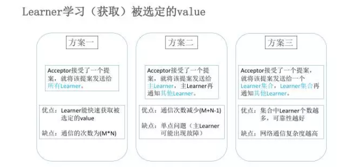

* zk中paxos算法推导中Learner学习被选定的value的方案二中通信次数减少的推导过程

```text
主learner将信息同步到其他learner的paxos算法的通信次数计算
```
* paxos算法的详细推导以及实现过程

* [Zookeeper ZAB 协议分析](https://dbaplus.cn/news-141-1875-1.html)

* [开源日志监控系统](https://blog.csdn.net/achiberx/article/details/71633911)

* [Java NIO IO BIO]()

* [java-nio-server](https://github.com/jjenkov/java-nio-server)