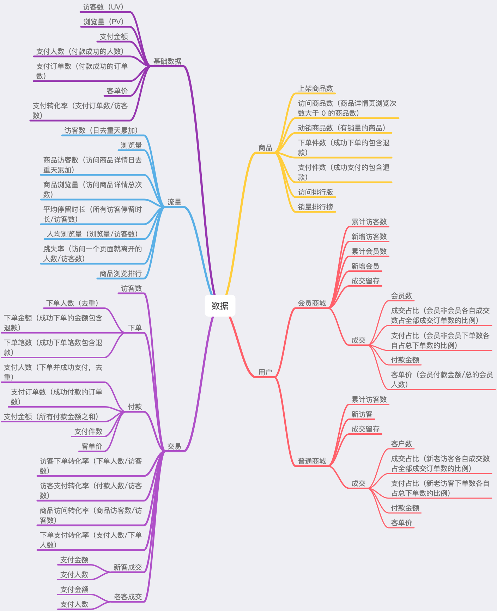

## zaimiLogCenter
> 当前整理的数据结构
```java
{
	"_index": "nginx-access-2019.08.02",
	"_type": "mall",
	"_id": "1IQoUGwBksSroZEG6RbG",
	"_score": "1",
	"@timestamp": "2019-08-02T10:29:12.177Z",
	"offset": "751417",
	"args": "c=K1E2ET5M4C",
	"scheme": "http",
	"client": "K1E2ET5M4C",
	"hostname": "test-r3",
	"domain": "test.b43.cn",
	"eventType": "api",
	"geoip": {
		"ip": "125.119.254.24",
		"latitude": 
		"region_name": "Zhejiang",
		"city_name": "Hangzhou",
		"country_name": "China",
		"longitude": "120.1614",
	},
	"url": "/api/search/recommend",
	"size": "2137",
	"status": "200",
	"ip": "125.119.254.24",
	"cookie": "Y2Q3NjBlNzUtMGIxYS00MDE3LTkyZGQtZjU0OGRkNzAxNTM5",
	"request_method": "POST",
	"body": "page=1&pageSize=10",
	"ua": "Mozilla/5.0 (iPhone; CPU iPhone OS 11_0 like Mac OS X) AppleWebKit/604.1.38 (KHTML, like Gecko) Version/11.0 Mobile/15A372 Safari/604.1",
	"eventTime": "2019-08-02T10:29:11+08:00",
	"source": "/var/log/nginx/access.log",
	"responsetime": "0.082",
	"from": "mall",
	"referer": "http://test.b43.cn/?c=K1E2ET5M4C",
	"proxy": ""
}
```


当前es数据地址:http://47.111.177.27:9100
链接的数据源: http://47.97.24.238:9201
```text
日志系统暂时用Filebeat+ELK，来实现采集、清洗、存储，
Filebeat（采集）===> Logstash（清洗）===> Elasticsearch（存储）===> Kibana（展示）

后面日志量大的时候，可以加上kafka，做一个缓冲
Filebeat（采集）===> Kafka（消息队列）===> Logstash（清洗）===> Elasticsearch（存储）===> Kibana（展示）

后面如果有更好的方案，可以替换掉

测试环境ES地址：http://47.97.24.238:9201/
测试环境Kibana地址：http://47.97.24.238:5700（汉化过的）

kibana、logstash测试环境装在test-07上

prometheus监控：https://prometheus.io/

grafana数据可视化：https://grafana.com/

```


https://blog.csdn.net/ydwyyy/article/details/79487995

https://elasticsearch.cn/article/190 es优化 
https://blog.csdn.net/donghaixiaolongwang/article/details/79208457  慢查询日志配置

https://blog.csdn.net/weixin_43557605/article/details/102799734 常用命令

https://blog.csdn.net/laoyang360/article/details/100070285  高级调优方法论之——根治慢查询！

https://cloud.tencent.com/developer/article/1357698 为什么Elasticsearch查询变得这么慢了？