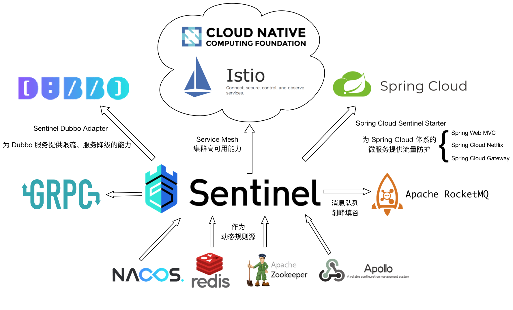

## [Sentinel;分布式系统的流量防卫兵](https://github.com/alibaba/Sentinel/wiki/%E4%BB%8B%E7%BB%8D)
```text
Sentinel以流量为切入点，从流量控制、熔断降级、系统负载保护等多个维度保护服务的稳定性。
Sentinel具有以下特征：
* 丰富的应用场景：承接双十一大促流量的核心场景，如秒杀、削峰填谷、集群流量控制、实时熔断下游不可用应用等。
* 完备的实时监控：可以在控制台中看到接入应用的单台机器秒级数据甚至500台以下规模的集群的汇总运行情况
* 广泛的开源生态：开箱即用以及与其他开源框架/库的整合模块。如spring cloud、Dubbo、gRPC的整合
* 完善的SPI扩展点：提供简单易用、完善的SPI的扩展接口

```



```text
Sentinel分为两个部分：
* 核心库(Java 客户端)不依赖任何框架/库，能够运行于所有Java运行时环境，同时对Dubbo/Spring Cloud等框架也有较好的支持
* 控制台(Dashboard)基于Spring Boot开发，打包后可以直接运行，不需要额外的Tomcat等应用容器

``` 

