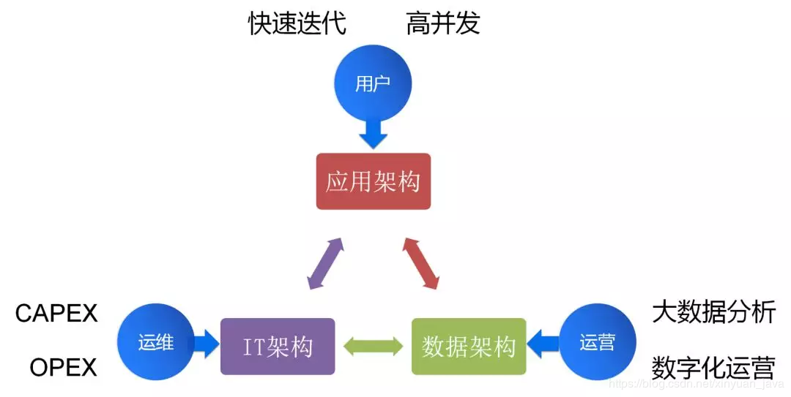
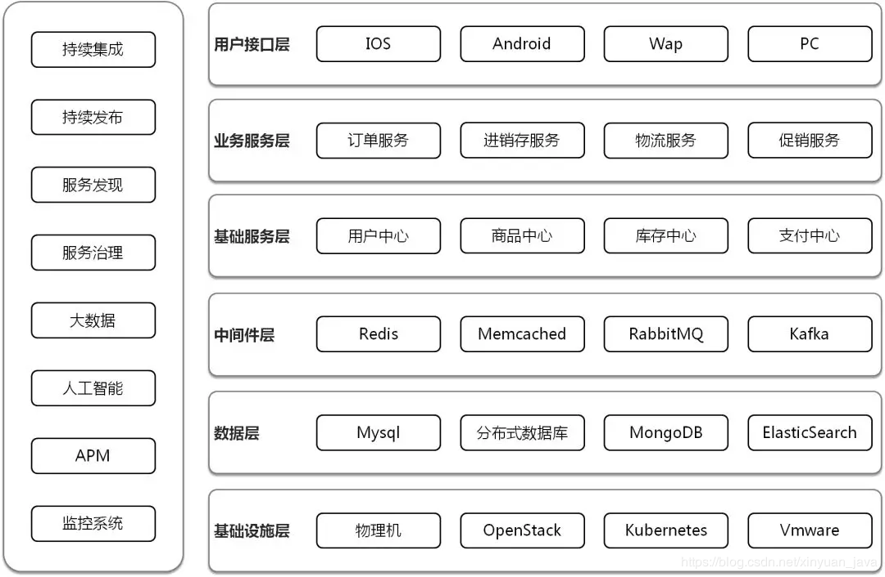

[一、架构的三个维度和六个层面](https://blog.csdn.net/xinyuan_java/article/details/97132067)(https://cloud.tencent.com/developer/article/1451286)(https://mp.weixin.qq.com/s/tBQ5tjSqk94_AtrgYgO0xA?utm_medium=hao.caibaojian.com&utm_source=hao.caibaojian.com)

 
1.1、三大架构

在互联网时代，要做好一个合格的云架构师，需要熟悉三大架构。 

第一个是IT架构，其实就是计算，网络，存储。这是云架构师的基本功，也是最传统的云架构师应该首先掌握的部分，良好设计的IT架构，可以降低CAPEX和OPEX，减轻运维的负担。数据中心，虚拟化，云平台，容器平台都属于IT架构的范畴。

第二个是应用架构，随着应用从传统应用向互联网应用转型，仅仅搞定资源层面的弹性还不够，常常会出现创建了大批机器，仍然撑不住高并发流量。因而基于微服务的互联网架构，越来越成为云架构师所必需的技能。良好设计的应用架构，可以实现快速迭代和高并发。数据库，缓存，消息队列等PaaS，以及基于SpringCloud和Dubbo的微服务框架，都属于应用架构的范畴。

第三个是数据架构，数据成为人工智能时代的核心资产，在做互联网化转型的同时，往往进行的也是数字化转型，并有战略的进行数据收集，这就需要云架构师同时又大数据思维。有意识的建设统一的数据平台，并给予数据进行数字化运营。搜索引擎，Hadoop，Spark，人工智能都属于数据架构的范畴。

1.2、六个层面

上面的三个维度是从人的角度出发的，如果从系统的角度出发，架构分六个层次。

第一个层次是基础设施层，在数据中心里面，会有大量的机架，大量的服务器，并通过交换机和路由器将服务器连接起来，有的应用例如Oracle是需要部署在物理机上的。为了管理的方便，在物理机之上会部署虚拟化，例如Vmware，可以将对于物理机复杂的运维简化为虚拟机灵活的运维。虚拟化采取的运维方式多是由运维部门统一管理，当一个公司里面部门非常多的时候，往往要引入良好的租户管理，基于Quota和QoS的资源控制，基于VPC的网络规划等，实现从运维集中管理到租户自助使用模式的转换，托生于公有云的OpenStack在这方面做的是比较好的。随着应用架构越来越重要，对于标准化交付和弹性伸缩的需求越来越大，容器最为软件交付的集装箱，可以实现基于镜像的跨环境迁移，Kubernetes是容器管理平台的事实标准。

 

第二个层次是数据层，也即一个应用的中军大营，如果是传统应用，可能会使用Oracle，并使用大量的存储过程，有大量的表联合查询，成本也往往比较高。但是对于高并发的互联网应用，需要进行微服务的拆分，数据库实例会比较多，使用开源的Mysql是常见的选择，大量的存储过程和联合查询往往会使得微服务无法拆分，性能会比较差，因而需要放到应用层去做复杂的业务逻辑，数据库表和索引的设计非常重要。当并发量比较大的时候，需要实现横向扩展，就需要基于分布式数据库，也是需要基于单库良好的表和索引设计。对于结构比较灵活的数据，可以使用MongoDB数据库，横向扩展能力比较好。对于大量的联合查询需求，可以使用ElasticSearch之类的搜索引擎来做，速度快，更加灵活。

 

第三个层次是中间件层，因为数据库层往往需要保证数据的不丢失以及一些事务，因而并发性能不可能非常大，所以我们经常说，数据库是中军大营，不能所有的请求都到这里来，因而需要一层缓存层，用来拦截大部分的热点请求。Memcached适合做简单的key-value存储，内存使用率比较高，而且由于是多核处理，对于比较大的数据，性能较好。但是缺点也比较明显，Memcached严格来讲没有集群机制，横向扩展完全靠客户端来实现。另外Memcached无法持久化，一旦挂了数据就都丢失了，如果想实现高可用，也是需要客户端进行双写才可以。Redis的数据结构比较丰富，提供持久化的功能，提供成熟的主备同步，故障切换的功能，从而保证了高可用性。另外微服务拆分以后，有时候处理一个订单要经过非常多的服务，处理过程会比较慢，这个时候需要使用消息队列，让服务之间的调用变成对于消息的订阅，实现异步处理。RabbitMQ和Kafka是常用的消息队列，当事件比较重要的时候，会结合数据库实现可靠消息队列。

 

第四个层次是基础服务层，有的时候成为中台层，将通用的能力抽象为服务对外提供原子化接口。这样上层可以根据业务需求，通过灵活的组合这些原子化接口，灵活的应对业务需求的变化，实现能力的复用，以及数据的统一管理，例如用户数据，支付数据，不会分散到各个应用中。另外基础服务层称为应用和数据库和缓存的一个分界线，不应该所有的应用都直接连数据库，一旦出现分库分表，数据库迁移，缓存选型改变等，影响面会非常大，几乎无法执行。如果将这些底层的变更拦截在基础服务层，上层仅仅使用基础服务层的接口，这样底层的变化会对上层透明，可以逐步演进。

 

第五个层次是业务服务层，或者组合服务层，大部分的业务逻辑都是在这个层面实现，业务逻辑比较面向用户，因而会经常改变，所以需要组合基础服务的接口进行实现。在这一层，会经常进行服务的拆分，实现开发独立，上线独立，扩容独立，容灾降级独立。微服务的拆分不应该是一个运动，而应该是一个遇到耦合痛点的时候，不断解决，不断演进的一个过程。微服务拆分之后，有时候需要通过分布式事务，保证多个操作的原子性，也是在组合服务层来实现的。

 

第六个层次是用户接口层，也即对终端客户呈现出来的界面和APP，但是却不仅仅是界面这么简单。这一层有时候称为接入层。在这一层，动态资源和静态资源应该分离，静态资源应该在接入层做缓存，使用CDN进行缓存。也应该UI和API分离，界面应该通过组合API进行数据拼装。API会通过统一的API网关进行统一的管理和治理，一方面后端组合服务层的拆分对APP是透明的，一方面当并发量比较大的时候，可以在这一层实现限流和降级。

 

为了支撑这六个层次，在上图的左侧是一些公共能力。

持续集成和持续发布是保证微服务拆分过程中的快速迭代，以及变更后保证功能不变的，不引入新的Bug。

服务发现和服务治理是微服务之间互相的调用，以及调用过程中出现异常情况下的熔断，限流，降级策略。

大数据和人工智能是通过收集各个层面的数据，例如用户访问数据，用户下单数据，客服询问数据等，结合统一的中台，对数据进行分析，实现智能推荐。

监控与APM是基础设施的监控和应用的监控，发现资源层面的问题以及应用调用的问题。

 

作为一个云架构师还是很复杂的。

 

一、手动安装起来，一定要手动

二、使用一下，推荐XXX in Action系列

三、读文档，读所有的官方文档，记不住，看不懂也要读下来

四、了解核心的原理和算法，推荐XXX the definitive guide系列

五、看一本源码分析的书，会让你的源码阅读之旅事半功倍

六、开始阅读核心逻辑源代码

七、编译并Debug源代码

八、开发一个插件，或者对组件做少量的修改

九、大量的运维实践经验和面向真实场景的定制开发