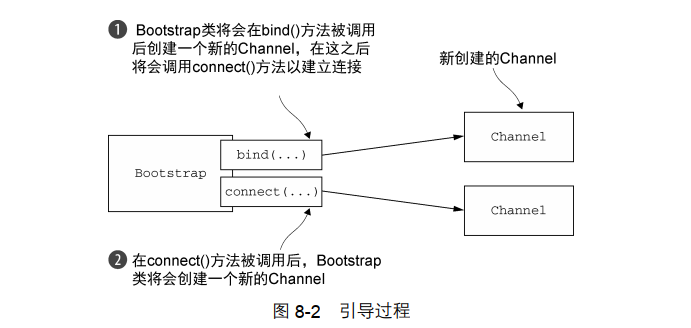

## Netty实战

#### Java NIO
> 在代码清单1-1中代码底层的阻塞系统调用外，本地套接字库很早就提供了非阻塞调用，其为网络资源的利用率提供了相当多的控制：
```text
* 可以使用setsocketopt()方法配置套接字，以便读/写调用在没有数据的时候立即返回，也就是说，如果是一个阻塞调用应该已经被阻塞了；
* 可以使用操作系统的事件通知API注册一组非阻塞套接字，以确定他们中是否存在任何的套接字已经有数据可供读写.

在NIO中Selector是非阻塞实现的关键。它使用了事件通知API以确定在一组非阻塞套接字中有哪些已经就绪能够进行I/O相关的操作。可以检查任意时间的读写操作的状态，所以一个单一的线程就可以处理多个并发的连接
```

> NIO模型能够更好的管理资源
```text
* 使用较少的线程便可以处理许多连接，因此也减少了内存管理和上下文切换所带来的的开销；
* 当没有I/O操作需要处理的时候，线程也可以被用于其他任务。

```

#### Netty
> Netty的特性总结

| 分类 | Netty特性 |
|------|-----------|
| 设计 | 统一的API，支持多种传输类型，阻塞的和非阻塞的 <p> 简单而强大的线程模型<p>真正的无连接数据报套接字支持<p>链接逻辑组件以支持复用 |
| 易于使用 | 详实的Javadoc和大量的示例集<p> 不需要超过JDK1.6+的依赖(一些可选的特性可能需要1.7+或/和额外的依赖) |
| 性能 | 拥有比Java的和兴API更高的吞吐量以及更低的延迟<p>得益于池化和复用，拥有更低的资源消耗<p>最少的内存复制 |
| 健壮性 | 不会因为慢速、快速或者超载的连接而导致OutOfMemoryError<p>消除在高速网络中NIO应用长须常见的不公平读写比率 |
| 安全性 | 完整的SSL/TLS以及StartTLS支持<p>可用于受限环境下，如Applet和OSGI |
| 社区驱动 | 发布快速而且频繁 |

> 异步和可伸缩之间的关系
```text
* 非阻塞网络调用使得我们可以不必等待一个操作的完成。完全异步的I/O正是基于这个特性构建的，并且更进一步：异步方法会立即返回，并且在它完成时，会直接或者在稍后的某个时间点通知用户。
* 选择器使得我们能够通过较少的线程便可监视许多连接上的事件。

```

#### Netty核心组件
```text
* channel
* 回调
* Future
* 事件和ChannelHandler
这些构建快代表了不同类型的构造：资源、逻辑以及通知。应用程序将使用这些来访问网络以及流经网络的数据。
```

* channel
```text
是NIO的一个基本构造：代表一个到实体(如一个硬件设备、一个文件、一个网络套接字或者一个能够执行一个或多个不同的I/O操作的程序组件)的开放连接，如读操作和写操作。
目前可以把Channel看作是传入(入站)或者传出(出站)数据的载体。因此它可以被打开或者被关闭，连接或者断开连接。
```

* 回调
```text
一个回调其实就是一个方法，一个指向已经被提供给另外一个方法的 方法的引用。这使得后者可以在适当的时候调用前者。
当Netty的一个回调被触发时，相关事件可以被一个interface-ChannelHandler的实现处理。下面代码展示了：当一个新的连接已经被建立时，ChannelHandler的channelActive()回调方法将会被调用，并打印出一条信息。
```
```java
// 被回调触发的ChannelHandler  当一个新的连接已经被建立时，channelActive(ChannelHandler Context)将会被调用
public class ConnectHandler extends ChannelInboundHandlerAdapter {
    @Override
    public void channelActive(ChannelHandlerContext ctx) throws Exception {
        System.out.println("Client " + ctx.channel.remoteAddress() + " connected");
    }
}
```

* Future
```text
提供了在操作完成时通知应用程序的方式：实现仅允许手动检查对应的操作是否已经完成，或者一直阻塞直到完成。Netty中提供了一个自己的实现-ChannelFuture，用于在执行异步操作的时候使用。
ChannelFuture提供了几种额外的方法能够注册一个或多个CHannelFutureListener实例。监听器的毁掉方法operationComplete()，将会在对应的操作完成时被调用。监听器可以判断该操作是成功的完成了还是出错了。监听器提供的通知机制消除了手动检查对应的操作是否完成的必要。
下面代码展示了一个ChannelFuture作为一个I/O操作的一部分返回的例子。这里connect()方法将会直接返回而不会阻塞，该调用将会在后台完成。
```
```java
// 异步地建立连接
Channel channel = ...;
// Does not block 异步地连接到远程节点
ChannelFuture future = channel.connect(new InetSocketAddress("102.168.0.1", 25));
```
```java
// ChannelFutureListener监听的回调实战
Channel channel = ...;
// Does not block 异步地连接到远程节点
ChannelFuture future = channel.connect(new InetSocketAddress("192.168.0.1", 25));
// 注册一个ChannelFutureListener，以便在操作完成时获得通知
future.addListener(new CHannelFutureListener() {
    @Override
    public void operationComplete(ChannelFuture future) {
        if (future.isSuccess()) {
            // 如果操作是成功的，则创建一个ByteBuf以持有数据
            ByteBuf buffer = Unpooled.copiedBuffer("Hello", Charset.defaultCharset());
            // 将数据异步地发送到远程节点返回一个ChannelFuture
            ChannelFuture wf = future.channel().writeAndFlush(buffer);
            ...
        } else {
            // 如果发生错误，则访问描述原因的Throwable
            Throwable cause = future.cause();
            cause.printStackTrace();
        }
    }
})
```
> 回调和Future是相互补充的机制

* 事件和ChannelHandler
```text
Netty 使用不同的事件来通知状态的改变或者是操作的状态。这样能够基于已经发生的事件来触发适当的动作。如：
* 记录日志
* 数据转换
* 流控制
* 应用程序逻辑
```
> 可能由入站数据或者相关的状态更改而触发的事件包括：
```text
* 连接已经被激活或者连接失活
* 数据读取
* 用户事件
* 错误事件 
```

> 出站事件是未来将会触发的某个动作的操作结果，包括：
```text
* 打开或者关闭到远程节点的连接
* 将数据写到或者冲刷到套接字
```

> Netty 通过触发事件将Selector从应用程序抽象出来，消除了所有本来将需要手动编写的派发代码。在内部，将会为每个Channel分配一个EventLoop，用于处理所有事件，包括：
```text
* 注册感兴趣的事件
* 将事件派发给ChannelHandler
* 安排进一步的动作
```
>> EventLoop本身只由一个线程驱动，其处理了一个Channel的所有I/O 事件，并且在改EventLoop的整个生命周期内都不会改变。这个设计消除了可能有的在ChannelHandler实现中需要进行同步的顾虑。

#### ChannelHandler 和业务逻辑
> ChannelHandler 是一个接口族的父接口，它的实现负责接收并响应时间通知，在Netty应用程序中，所有数据处理逻辑都包含在这些核心抽象的实现中。服务器需要实现ChannelInboundHandler接口，用来定义响应入站事件的方法。下面是感兴趣的几个方法
```text
* channelRead():对于每个传入的消息都要调用
* channelReadComplete(): 通知ChannelInboundHandler最后一次对channelRead()的调用是当前批量读取中的最后一条消息
* exceptionCaught():在读取操作期间，有异常抛出时会调用。
 Echo服务器的ChannelHandler实现是EchoServerHandler类，代码在netty-demo:com.example.netty.center.echo.server  或 tianyi-netty:com.tianyi.origin.netty.netty
```
> ChannelInboundHandlerAdapter API中的每个方法都可以被重写以挂钩到事件生命周期的恰当点上。重写exceptionCaught()方法允许对Throwable的任何子类型做出反应。
```text
如果不捕获异常，会发生什么？
每个Channel都拥有一个与之相关联的ChannelPipeline，其持有一个ChannelHandler的实例链。在默认情况下，ChannelHandler会把对它的方法的调用转发给链接中的下一个ChannelHandler。因此，如果exceptionCaught()方法没有被该链中的某处实现，那么所接受的异常将会被传递到ChannelPipeline的尾端并被记录。为此，应用程序应该提供至少有一个实现了exceptionCaught()方法的ChannelHandler。
```
> 除了上面实现了的ChannelInboundHandlerAdapter之外，还有很多其他的ChannelHandler的子类型和实现。
```text
* 针对不同类型的事件来调用ChannelHandler
* 应用程序通过实现或扩展ChannelHandler来挂钩到事件的生命周期，并且提供自定义的应用程序逻辑
* 在架构上，ChannelHandler有助于保持业务逻辑与网络代理代码的分离。这简化了开发过程，因为代码必须不断的演化以响应不断变化的需求
```

#### 引导服务器
```text
* 绑定到服务器将在其上监听并接受传入连接请求的端口
* 配置Channel，以将有关的入站消息通知给EchoServerHandler实例
```
> 传输：在网络协议的标准多层视图中，传输层提供了端到端的或者主机到主机的通信服务。 因特网通信是建立在TCP传输之上的。除了一些由Java NIO实现提供的服务器端性能增强之外，NIO传输大多数时候指的就是TCP传输。
```text
在代码清单2-2中的重要步骤：
* EchoServerHandler实现了业务逻辑
* main方法引导了服务器
引导过程中所需要的步骤如下：
* 创建一个ServerBootstrap的实例以引导和绑定服务器
* 创建并分配一个NioEventLoopGroup实例以进行时间的处理，如接受新连接以及读/写数据
* 指定服务器绑定的本地的InetSocketAddress
* 使用一个EchoServerHandler的实例初始化每一个新的Channel
* 调用ServerBootstrap.bind()方法以绑定服务器
这时候服务器已经初始化并且已经就绪能被使用了。
```

#### 客户端
```text
Echo 客户端处理：
* 连接到服务器
* 发送一个或者多个消息
* 对于每个消息，等待并接收从服务器发回的相同的消息
* 关闭连接
客户端所涉及的也是业务逻辑和引导。
```
> 客户端将拥有一个用来处理数据的ChannelInboundHandler，在这个场景下，将扩展SimpleChannelInboundHandler类以处理所有必须的任务。这要求重写下面的方法：
```text
* channelActive():在到服务器的连接已经建立之后将被调用
* channelRead(): 当从服务器接收到一条消息时被调用
* exceptionCaught(): 在处理过程中引发异常时被调用
客户端的实现逻辑：tianyi-netty:com.tianyi.origin.netty.netty
```
```text
SimpleChannelInboundHandler与ChannelInboundHandler
    客户端使用的是SimpleChannelInboundHandler而服务器端EchoServerHandler使用的是ChannelInboundHandlerAdapter？这两个使用不同的ChannelHandler和两个因素的相互作用有关：业务逻辑如何处理消息以及Netty如何管理资源。
    在客户端，当channelRead0()方法完成时，已经有了传入的消息，并且已经处理完了。当该方法返回时，SimpleChannelInboundHandler负责释放指向保存该消息的ByteBuf的内存引用。
    在EchoServerHandler中，任然需要将传入消息会送给发送者，而write()操作是异步的，直到channelRead()方法方法返回后可能仍然没有完成。为此，EchoServerHandler扩展了ChannelInboundHandlerAdapter，其在这个时间点不会释放消息
    消息在EchoServerHandler的channelReadComplete()方法中，当writeAndFlush()方法被调用时释放
    客户端代码tianyi-netty：com.tianyi.origin.netty.netty
```

####　引导客户端
```text
引导客户端代码tianyi-netty：com.tianyi.origin.netty.netty
客户端代码要点：
* 为初始化客户端，创建一个Bootstrap
* 为进行事件处理分配了一个NioEventLoopGroup实例，其中事件包括创建新的连接以及处理入站和出站数据
* 为服务器连接创建了一个InetSocketAddress实例
* 当连接被建立时，一个EchoClientHandler实例会被安装到(该Channel的)ChannelPipeline中
* 在一切都设置完成后，调用Bootstrap.connect()方法连接到远程节点
```

#### Channel、EventLoop和ChannelFuture
```text
* Channel: Socket;
* EventLoop: 控制流、多线程处理、并发
* ChannelFuture: 异步通知
```

* Channel接口
```text
基本的I/O操作(bing()、connect()、read()和write())依赖于底层网络传输所提供的的原语。Channel拥有许多预定义的、专门化实现的广泛类层次结构的根：
* EmbeddedChannel
* LocalServerChannel
* NioDatagramChannel
* NioSctpChannel
* NioSocketChannel
```
* EventLoop接口

```text
这些关系是：
* 一个EventLoopGroup包含一个或者多个EventLoop
* 一个EventLoop在它的生命周期内只和一个Thread绑定
* 所有有EventLoop处理的I/O事件都将在它专有的Thread上被处理
* 一个Channel在它的生命周期内只注册于一个EventLoop
* 一个EventLoop可能会被分配给一个或者多个Channel

一个给定的Channel的I/O操作都是由相同的Thread执行的，实际上消除了对于同步的需要。
```

* ChannelFuture接口
> ChannelFuture接的中的addListener()方法注册了一个ChannelFutureListener，以便在某个操作完成时(无论成功与否)得到通知

#### ChannelHandler和ChannelPipeline
* ChannelHandler接口
> ChannelHandler充当了所有处理入站和出站数据的应用程序逻辑的容器，是由网络时间处罚的。
```text
例如：
ChannelInboundHandler是ChannelHandler的子接口，接收入站事件和数据，随后被应用程序的业务逻辑处理。当需要给客户端发送响应时，也可以从ChannelInboundHandler中冲刷数据，应用程序业务逻辑通常驻留在一个或多个ChannelInboundHandler中。

```

* ChannelPipeline接口
> ChannelPipeline提供了ChannelHandler链的容器，并定义了用于在该链上传播入站和出站事件流的API。Channel在创建时会被自动分配到它专属的CHannelPipeline
```text
ChannelHandler安装到ChannelPipeline中的过程如下：
* 一个ChannelInitializer的实现被注册到ServerBootstrap中
* 当ChannelInitializer.initChannel()方法被调用时，ChannelInitializer将在ChannelPipeline中安装一组自定义的ChannelHandler
* ChannelInitializer将他自己从ChannelPipeline中移除

```

> 被称为ChannelPipeline的是这些ChannelHandler的编排顺序
```text
从一个客户端应用程序角度看，如果事件运动方向是从客户端到服务器端，那么称这些事件为出站，反之为入站
```


```text
下面几个是编写自定义ChannelHandler经常会用到的适配器类   
* ChannelHandlerAdapter
* ChannelInboundHandlerAdapter
* ChannelOutboundHandlerAdapter
* ChannelDuplexHandler

```

#### 编码器和解码器
> 

#### SimpleChannelInboundHandler

#### 引导
| 类别 | Bootstrap | ServerBootstrap |
|------|-----------|-----------------|
| 网络编程中的作用 | 连接到远程主机和端口 | 绑定到一个本地端口 |
| EventLoopGroup的数目 | 1 | 2 |

## 传输
```text
OIO -- 阻塞传输
NIO -- 异步传输
Local -- JVM内部的异步通信
Embedded -- 测试你的ChannelHandler
```
> 流经网络的数据是字节，字节如何流动取决于网络传输
```text
代码清单 4-1 未使用Netty的阻塞网络编程
代码清单 4-2 我使用Netty的异步网络编程
代码清单 4-3 使用Netty的阻塞网络处理
代码清单 4-4 使用Netty的非阻塞网络处理
```
#### 传输API
```text
传输API的核心是interface Channel，它被用于所有的I/O操作，Channel类的层次结构如下图
```

```text
每一个Channel都会被分配一个ChannelPipeline和ChannelConfig。ChannelConfig包含了该Channel的所有配置设置，并且支持热更新。由于传输有可能的独特性，所以可能会实现一个ChannelConfig的子类型。
由于Channel的独一无二，所以为了保证顺序将Channel声明为java.lang.Comparable的一个子接口。因此，如果两个不同的Channel实例都反悔了相同的散列码，那么AbstractChannel中的compareTO()方法的实现将会抛出一个Error。
ChannelPipeline持有所有将应用于入站和出站数据以及事件的ChannelHandler实例，这些ChannelHandler实现了应用程序用于处理状态变化以及数据处理的逻辑

* ChannelHandler 的典型用途包括：
1、将数据从一种个数转换为另一种格式
2、提供异常的通知
3、提供Channel变为活动的或者非活动的通知
4、提供当Channel注册到EventLoop或者从EventLoop注销时的通知
5、提供有关用户自定义事件的通知。

```
* **拦截过滤器** ChannelPipeline实现了一种常见的设计模式-拦截过滤器(Intercepting Filter).UNIX管道是另外一个熟悉的例子：多个命令被链接在一起，其中一个命令的输出端将连接到命令行中下一个命令的输入端。

> Channel的方法

| **方法名** | _**描述**_ |
|------------|------------|
|eventLoop| 返回分配给Channel的EventLoop |
|pipeline|返回分配给Channel的ChannelPipeline|
|isActive| 如果Channel是活动的则返回true。活动的意义可能依赖于底层的传输。例如一个Socket传输一旦链接到了远程节点便是活动的，而一个Datagram传输一旦被打开便是活动的|
|localAddress| 返回本地的SocketAddress |
|remoteAddress| 返回远程的SocketAddress|
|write| 将数据写到远程节点。这个数据将被传递给ChannelPipeline,并且排队知道它被冲刷|
|flush| 将之前已写的数据冲刷到底层传输，如一个Socket|
|writeAndFlush| 一个简便的方法，等同于调用write()并接着调用flush()|

```java
// 代码清单 4-5  写出到Channel
Channel channel = ...
// 创建持有要写数据的ByteBuf
ByteBuf buf = Unpooled.copiedBuffer("your data", CharsetUtil.UTF_8);
// 写数据并冲刷它
ChannelFuture ch = channel.writeAndFlushbuf();
// 添加ChannelFutureListener以便在写操作完成后接收通知
cf.addListener(new ChannelFutureListener() {
   @Override
   public void operationComplete(ChannelFuture future) {
       if (future.isSuccess()) {
           // 写操作完成，并且没有错误发生
           System.out.println("Write successful");
       } else {
           // 记录错误
           System.out.println("Write error");
           future.cause().printStackTrace();
       }
   } 
});
```
```text
// 代码清单 4-6 从多个线程使用同一个Channel
final Channel channel = ...
// 创建持有要写数据的ByteBuffer
final ByteBUf buf = Unpooled.copiedBuffer("your data", CharsetUtil.UTF_8).retain();
// 创建将数据写到Channel的Runnable
Runnable write = new Runnable() {
    @Override
    public void run() {
        channel.writeAndFlush(buf.duplicate());
    }
};
// 获取到线程池Executor的引用
Executor executor = Executors.newCachedThreadPool();
// write in one thread 递交写任务给线程池以便在某个线程中执行
executor.execute(writer);
// write in another thread 递交另一个写任务以便在另一个线程中执行
executor.execute(writer);

```

#### 内置的传输
> Netty中不是所有的传输都支持每一种协议，所以需选择一个与应用程序所使用的的协议相容的传输。 如下是Netty所提供的的传输

| 名称 | 包 | 描述 |
|------|----|------|
|NIO| io.netty.channel.socket.nio|使用java.nio.channels包作为基础--基于选择器的方式|
|Epoll|io.netty.channel.epoll|由JNI驱动的epool()和非阻塞IO。这个传输支持只有在Linux上可用的多种特性，如SO_REUSEPORT，比NIO传输更快，而且是完全非阻塞的|
|OIO|io.netty.channel.socket.oio|使用java.net包作为基础--使用阻塞流|
|Local|io.netty.channel.local|可以在VM内部通过管道进行通信的本地传输|
|Embedded|io.netty.channel.embedded|Embedded传输，允许使用ChannelHandler而又不需要一个真正的基于网络的传输，这在测试ChannelHandler实现时非常有用|

* NIO-非阻塞I/O
> NIO利用jdk中的基于选择器的API提供了一个所有I/O操作的全异步的实现。 选择器背后的基本概念是充当一个注册表，可以请求在Channel的状态发生变化时得到通知。可能的状态变化有：
```text
* 新的Channel已被接受并且就绪
* Channel连接已经完成
* Channel有已经就绪的可供读取的数据
* Channel可用于写数据

```
> 选择器运行在一个检查状态变化并对其做出相应响应的线程上，在应用程序对状态的改变做出响应之后，选择器将会被重置，并将重复这个过程。下面是java.nio.channels.SelectionKey定义的位模式。这些位模式可以组合起来定义一组应用程序正在请求通知的状态变化集。

| 名称 | 描述 |
|------|------|
|OP_ACCEPT| 请求在接受新连接并创建Channel时获得通知|
|OP_CONNECT| 请求在建立一个连接时获得通知|
|OP_READ| 请求当数据已经就绪，可以从Channel中读取时获得通知|
|OP_WRITE|请求当可以向Channel中写更多的数据时获得通知。这处理了套接字缓冲区被写完全填满时的情况，这种情况通常发生在数据的发送速度比远程节点可处理的速度更快的时候|


> 零拷贝
```text
零拷贝(zero-copy)是一种目前只有在使用NIO和Epool传输时才可使用的特性。它使你可以快速高效的将数据从文件系统移动到网络接口，而不需要将其从内核空间复制到用户空间，其在像FTP或者HTTP这样的协议中可以显著的提升性能。但是，并不是所有的操作系统都支持这一特性。特别地，它对于实现了数据加密或者压缩的文件系统是不可用的-只能传输文件的原始内容。反过来说，传输已被加密的文件则不是问题。
```


* Epoll-用于Linux的本地非阻塞传输
> epoll- 一个高度可扩展的I/O时间通知特性。
```text
如果应用程序在linux系统上运行 传输，可以考虑使用Netty提供的一组NIO API，将发现在高负载下它的性能要优于JDK的NIO实现
如果要使用epoll替代NIO，只需要将NioEventLoopGroup替换为EpollEventLoopGroup，并且将NioServerSocketChannel.class替换为EpollServerSocketChannel.class即可

```

* OIO - 旧的阻塞I/O
> Netty的OIO传输实现代表了一种折中：它可以通过常规的传输API使用，由于是建立在java.net包的阻塞实现上，所以它不是异步的。
```text
Netty通过SO_TIMEOUT这个socket标志，指定了等待一个I/O操作完成的最大毫秒数。
```

* 用于JVm内部通信的Local传输
> 用于在同一个JVM中运行的客户端和服务器程序之间的异步通信。
```text
Local传输中，和服务器Channel相关联的SocketAddress并没有绑定屋里网络地址；只要服务器还在运行，它就会被存储在注册表里并在Channel关闭时注销，这个传输并不接受外部的网络流量故而不能够和其他传输实现进行互相操作。因此 客户端连接到(在同一个JVM中)使用了这个传输的服务器端时也必须使用它。除了这个限制，使用方式和其他的传输一模一样。

```


* Embedded传输
> Netty提供了一中额外的传输，使得可以将一组ChannelHandler作为帮助器类嵌入到其他的ChannelHandler内部。通过这种方式可以扩展一个ChannelHandler功能而又不需要修改其内部代码。 
```text
Embedded传输的关键是一个被称为EmbeddedChannel的具体的Channel。后续将继续讨论如何使用这个类来为ChanelHandler使用。
```

* 传输
> 网络传输的基本单位是字节。

** 支持的传输和网络协议
× √

| 传输 | TCP | UDP | SCTP* | UDT(www.ietf.org/rfc/rfc2960.txt) |
|------|-----|-----|-------|-----|
| NIO | × | × | × | × |
| Epoll(仅linux) | × | × | - | - |
| OIO | × | × | × | × |
```text
* 在：Linux上启用SCTP    
    SCTP需要内核的支持，并且需要安装用户库。 如对于Ubuntu，可以使用如下命令：sudo apt-get install libsctpl
    对于Fedora,可以使用yum: sudo yum install kernel-modules-extra.x86_64 lksctp-tools.x86_64
```
>> * 非阻塞代码库- 可以使用NIO或者Epoll
>> * 阻塞代码库- 可以先改为OIO然后改为NIO
>> * 在同一个JVM内部通信- 
>> * 测试ChannelHandler实现-

> 应用程序的最佳传输

| 应用程序的需求 | 推荐的传输 |
|----------------|------------|
| 非阻塞代码库或者一个常规的起点 | NIO(或者在Linux上使用epoll) |
| 阻塞代码库 | OIO |
| 在同一个JVM内部的通信 | Local |
| 测试ChannelHandler的实现 | Embedded |


## ByteBuf(Netty的数据容器)
```text
* ByteBuf -- Netty 的数据容器
* API 的详细信息
* 用例
* 内存分配

Java NIO提供了ByteBuffer作为字节容器 而Netty则是ByteBuf
```
> Netty的ByteBuffer替代品是ByteBuf，一个强大的实现，既解决了JDK API的局限性，又为网络应用程序的开发者提供了更好的API。

* ByteBuf的API
> Netty的数据处理API通过两个组件暴露-abstract class ByteBuf和interface ByteBufHolder
```text
下面是一些ByteBuf API 的优点：
* 它可以被用户自定义的缓冲区类型扩展
* 通过内置的复合缓冲区类型实现了透明的零拷贝
* 容量可以按需增长(类似于JDK的StringBuilder)
* 在读和写这两种模式之间切换不需要调用ByteBuffer的flip()方法
* 读和写使用了不同的索引
* 支持方法的链式调用
* 支持引用计数
* 支持池化
```

* ByteBuf类--Netty的数据容器
> * ByteBuf的使用模式
* 代码清单 5-1
```java
代码清单 5-1 支撑数组
ByteBuf heapBuf = ...?
if (heapBuf.hasArray()) {// 检查ByteBuf是否支撑数组
    byte[] array = heapBuf.array(); // 如果有 则获取对该数组的引用
    int offset = heapBUf.arrayOffset() + heapBUf.readerIndex();// 计算第一个字节的偏移量
    int length = heapBuf.readableBytes();// 获取可读字节数
    handleArray(array, offset, length);// 使用数组、偏移量和长度作为参数调用方法 
}
```
```java
代码清单 5-2 访问直接缓冲区的数据
ByteBuf directBuf = ...?
if (!directBuf.hasArray()) {// 检查ByteBuf是否由数组支撑，如果不是，则这个是一个直接缓冲区
    int length = heapBuf.readableBytes();// 获取可读字节数
    byte[] array = new byte[length] // 分配一个新的数组来保存具有该长度的字节数据
    directBuf。getBytes(directBuf.readerIndex(), array); // 将字节复制到该数组
    handleArray(array, offset, length);// 使用数组、偏移量和长度作为参数调用方法 
}
```
```text
* 1 堆缓冲区
> 最常用的ByteBuf模式是将数据存储在JVM的堆空间中。这种这种模式被称为支撑数组(backing array)，它能在没有使用池化的情况下提供快速的分配和释放。非常适合于有遗留数据需要处理的情况，如代码清单5-1所示.

* 2 直接缓冲区
> 避免创建一个中间缓冲区。如代码清单5-2所示

* 3 复合缓冲区
> 为多个ByteBuf提供一个聚合视图。可以根据需要添加或删除ByteBuf实例。Netty通过一个ByteBuf子类-CompositeByteBuf--实现了这个模式，它提供了一个将多个缓冲区表示为单个合并缓冲区的虚拟表示。
>> CompositeByteBuf中的ByteBuf实例可能同时包含直接内存分配和非直接内存分配。如果其中只有一个实例，那么对CompositeByteBuf上的hasArray()方法的调用将返回该组件上的hasArray()方法的值，否则将返回false。
> 
代码清单 5-3 展示了如何通过使用JDK的ByteBuffer来实现这一需求。创建了一个包含两个ByteBuffer的数组用来保存这些消息组件，同时创建了第三个ByteBuffer用来保存所有这些数据的副本。

```
* 代码清单 5-3
```java
// 代码清单 5-3 使用ByteBuffer的复合缓冲区模式
// Use an array to hold the message parts
ByteBuffer[] message = new ByteBuffer[]{header, body};
// Create a new ByteBuffer and use copy to merge the header and body
ByteBuffer message2 = ByteBuffer.allocate(header.remaining() + body.remaining());
message2.put(header);
message2.put(body);
message2.flip();
// 分配和复制操作以及伴随着对数组管理的需要，是的实现效率低下而且笨拙
```
*代码清单 5-4
```java
// 代码清单 5-4 使用CompositeByteBuf的复合缓冲区模式
CompositeByteBuf messageBuf = Unpooled.compositeBuffer();
ByteBuf headerBuf = ...;// can be backing or direct
ByteBuf bodyBuf = ...;// can be backing or direct
// 将ByteBuf实例追加到CompositeByteBuf
messageBuf.addComponents(headerBuf, bodyBuf);
...
// 删除位于索引位置为0(第一个组件)的ByteBuf
messageBuf.removeComponent(0);// remove the header
for(ByteBuf buf : messageBuf) {// 循环遍历所有的ByteBuf实例
    System.out.println(buf.toString())
}
// CompositeByteBuf可能不支持访问其支撑数组，因此访问CompositeByteBuf中的数据类似于(访问)直接缓冲区的模式，如代码清单5-5
```
* 代码清单5-5
```java 
// 代码清单5-5 访问CompositeByteBuf中的数据
CompositeByteBuf compBuf = Unpooled.compositeBuffer();
int length = compBuf.readableBytes();// 获得可读字节数
byte[] array = new byte[length]; // 分配一个具有可读字节数长度的新数组
compBuf.getBytes(compBuf.readerIndex(), array);// 将字节读到该数组中
handleArray(array, 0, array.length);// 使用偏移量和长度作为参数使用该数组

// Netty 使用了CompositeByteBuf来优化套接字的I/O操作，尽可能地消除了由JDK的缓冲区实现所导致的性能问题以及内存使用率的惩罚。这种优化在Netty的核心代码中。
```
* 字节级操作
> * 随机访问索引
```text
同普通的Java字节数组一样，ByteBuf的索引是从零开始：第一个字节的索引是0，最后一个字节的索引总是capacity()-1.
```
* 代码清单 5-6
```java
// 代码清单 5-6 访问数据
ByteBuf buffer = ...;
for(int i = 0; i < buffer.capacity(); i++) {
    byte b = buffer.getByte(i);
    System.out.println((char)b);
}
// 使用那些需要一个索引值参数的方法(的其中)之一来访问数据既不会改变readerIndex也不会改变writerIndex.如果需要可以通过readerIndex(index)或者writerIndex(index)来手动移动这两者。
```

> * 顺序访问索引
```text
ByteBuf同时具有读索引和写索引，但是JDK的ByteBuffer却只有一个索引，所以必须使用flip()方法来在读模式和写模式之间进行切换的原因.夏天展示了ByteBuf是如何被两个索引划分为3个区域的。
```


> * 可丢弃字节
```text
可丢弃字段分段包含了已经被读过的字节。通过调用discardReadBytes()方法，可以丢弃他们并回收空间。这个分段的初始大小为0.存储在readerIndex中，会随着read操作的执行而增加(get*操作不会移动readerIndex).
下图5-4展示了缓冲区上调用discardReadBytes()方法后的结果。可以看到，可丢弃字节分段中的空间已经变为可写的了。在调用discardReadBytes()之后，对可写分段的内容并没有任何的保证。

这里不建议频繁调用discardReadBytes()方法，避免内存复制。因为可读字节必须被移动到缓冲区的开始位置。所以仅在真正需要的时候才这样做。
```


> * 可读字节
```text
ByteBuf的可读字节分段存储了实际数。新分配的、包装的或者复制的缓冲区的默认readerIndex值为0.任何名称以read或者skip开头的操作都将检索或者跳过位于当前readerIndex的数据，并将增加已读字节数。

如果被调用的方法需要一个ByteBuf参数作为写入的目标，并且没有指定目标索引参数，那么该目标缓冲区的writerIndex也将被增加，如 readBytes(ByteBuf dest);
如果尝试在缓冲区的可读字节数已经耗尽时从中读取数据，那么将会引发一个IndexOutOfBoundsException
```
```java
// 代码清单 5-7 读取所有数据
ByteBuf buffer = ...;
while(buffer.isReadable()) {
    System.out.println(buffer.readByte());
}
```
> * 可写字节（区分目标缓冲和源缓冲）
```text
可写字节分段是指一个拥有为定义内容、写入就绪的内存区域。新分配的缓冲区的writerIndex的默认值为0.任何名称以write开头的操作都将从当前的writerIndex处开始写数据，并将增加已经写入的字节数。如果写操作的目标也是ByteBuf，并且没有指定源索引的值，则缓冲区的readerIndex同样会被增加相同的大小，如 writeBytes(ByteBuf dest);
```
```java
// 代码清单 5-8 写数据，使用随机整数填充缓冲区，直到空间补助
// Fills the writable bytes of a buffer with random integers.
ByteBuf buffer = ...;
while(buffer.writableBytes() >= 4) { // writableBytes()方法在这里被用来确定该缓冲区中是否还有足够的空间
    buffer.writeInt(random.nextInt());
}
```
> * 索引管理
```text
JDK中InputStream定义了mark(int readlimit)和reset()方法，分别被用来将流中的当前位置标记为指定的值，以及将流重置到该位置。
ByteBuf中通过markReaderIndex()、markWriteIndex()、resetWriterIndex()和resetReaderIndex()来标记和重置ByteBuf的readerIndex和writerIndex.这些与InputStream类似，只是没有readlimit参数来标记失效时间. 也可使用readerIndex(int)或者writerIndex(int)来将索引移动到指定位置。试图将任何一个索引设置到一个无效的位置都将导致一个IndexOutOfBoundsException。
可以通过调用clear()方法将readerIndex和writerIndex都设置为0.注意 这里并不会清除内存中的内容。
```


```text
调用clear()方法比调用discardReadBytes()方法轻量得多，因为它只是将索引重置而不会复制任何内存。
```
> * 查找操作
```text
确定指定值的索引的方法最简单的是使用indexOf()方法，较复杂的查找可以通过那些需要一个ByteBufProcessor作为参数的方法达成。这个接口只定义了一个方法：boolean process(byte value).这个方法检查输入值是否是正在查找的值。
ByteBufProcessor针对一些常见的值定义了许多便利的方法。假设你的应用程序需要和所谓的包含有以NULL结尾的内容的Flash套接字集成。调用：forEachByte(ByteBUfProcessor.FIND_NUL).将简单高效地消费该Flash数据，在处理期间只会执行较少的边界检查。
```
```java
// 代码清单 5-9 使用 ByteBufProcessor来寻找\r
ByteBuf buffer = ...;
int index = buffer.forEachByte(ByteBufProcessor.FIND_CR);
```
> * 派生缓冲区
```text
派生缓冲区为ByteBuf提供了以专门的方式来呈现其内容的视图。这类视图是通过以下方法被创建的：
* duplicate();  // 复制
* slice(); // 分割
* slice(int, int);
* Unpooled.unmodifiableBuffer(...);
* order(ByteOrder)
* readSlice(int)
上面这些方法都将返回一个新的ByteBuf实例，具有自己的读索引、写索引和标记索引。内部存储和JDK的ByteBuffer一样也是共享的。这使得派生缓冲区的创建成本很低廉，也就意味着如果修改了它的内容，同时也修改了其对应的源实例。所以这里使用需要注意。

》 ByteBuf复制：如果需要现有缓冲区的真实副本，请使用copy()或者copy(int, int)方法，不同于派生缓冲区，由这个调用所返回的ByteBuf拥有独立的数据副本。
```
```java
// 代码清单 5-10 使用slice(int, int)方法来对ByteBuf进行切片
Charset utf8 = Charset.forName("UTF-8");
// 创建一个用于保存给定字符串的字节的ByteBuf。
ByteBuf buf = Unpooled.copiedBuffer("Netty in Action rocks!", utf8);
// 创建该ByteBuf从索引0开始到索引15结束的一个新切片
ByteBuf sliced = buf.slice(0,15);
// 将打印“Netty in Action”
System.out.pringln(sliced.toString(utf8));
// 更新索引0处的字节
buf.setByte(0, (byte)'J');
// 将会成功，因为数据是共享的，对其中一个所做的更改对另外一个也是可见的。
assert buf.getByte(0) == sliced.getByte(0);
```
```java
// 代码清单 5-11 复制一个ByteBuf
Charset utf8 = Charset.forName("UTF-8");
// 创建一个用于保存给定字符串的字节的ByteBuf。
ByteBuf buf = Unpooled.copiedBuffer("Netty in Action rocks!", utf8);
// 创建该ByteBuf从索引0开始到索引15结束的分段的副本。
ByteBuf sliced = buf.slice(0,15);
System.out.pringln(sliced.toString(utf8));
buf.setByte(0, (byte)'J');
// 将会成功，因为数据不是共享的。
assert buf.getByte(0) != sliced.getByte(0);
```
> * 读/写操作
```text
有两种类型的读/写操作：
* get()和set()操作，从给定的索引开始，并且爆出索引不变
* read()和write()操作，从给定的索引开始，并且会根据已经访问过的字节数对索引进行调整。
```
* 下表列举了常用get()方法

| 名称 | 描述 |
|------|------|
| getBoolean(int) | 返回给定索引处的Boolean值 |
| getByte(int) | 返回给定索引处的字节 |
| getUnsignedByte(int) | 将给定索引处的无符号字节值作为short返回 |
| getMedium(int) | 返回给定索引处的24位的中等int值 |
| getUnsignedMedium(int) | 返回给定索引处的无符号的24位的中等int值 |
| getInt(int) | 返回给定索引处的int值 |
| getUnsignedInt(int) | 返回给定索引处的无符号int值作为long返回 |
| getLong(int) | 返回给定索引处的long值 |
| getShort(int) | 返回给定索引处的short值 |
| getUnsignedShort(int) | 将给定索引处的无符号short值作为int返回 |
| getBytes(int, ...) | 将该缓冲区中从给定索引开始的数据传送到指定的目的地 |
* 下表列举了常用set()方法

| 名称 | 描述 |
|------|------|
| setBoolean(int, boolean) | 返回给定索引处的Boolean值 |
| setByte(int index, int value) | 设定给定索引处的字节值 |
| setMedium(int index, int value) | 设定给定索引处的24位的中等int值 |
| setInt(int index, int value) | 设定给定索引处的int值 |
| setLong(int index, long value) | 设定给定索引处的long值 |
| setShort(int index, int value) | 设定给定索引处的short值 |
```java
// 代码清单 5-12 get()和set()方法的用法
Charset utf8 = Charset.forName("UTF-8");
// 创建一个新的ByteBuf以保存给定字符串的字节
ByteBuf buf = Unpooled.copiedBuffer("Netty in Action rocks!", utf8);
// 打印第一个字符'N'
System.out.println((char)buf.getByte(0));
//存储当前的readerIndex和writerIndex
int readerIndex = buf.readerIndex();
int writerIndex = buf.writerIndex();
// 将索引0处的字节更新为字符'B'
buf.setByte(0, (byte)'B');
// 打印第一个字符 现在就是'B'
System.out.println((char)buf.getByte(0));
// 将会成功 因为这些操作并不会修改相应的缩影
assert readerIndex == buf.readerIndex();
assert writerIndex == buf.writerIndex();
```
* 下面列举了常用read()操作 起作用当前的readerIndex或writerIndex。这些方法将用于从ByteBuf中读取数据，如同是一个流

| 名称 | 描述 |
|------|------|
| readBoolean() | 返回当前readerIndex处的Boolean，并将readerIndex增加1 |
| readByte() | 返回当前readerIndex处的字节，并将readerIndex增加1 |
| readUnsignedByte() | 将当前readerIndex处的无符号字节值作为short返回，并将readerIndex增加1 |
| readMedium() | 返回当前readerIndex处的24为的中等int值，并将readerIndex增加3 |
| readUnsignedMedium() | 返回当前readerIndex处的无符号的24位的中等int值，并将readerIndex增加3 |
| readInt() | 返回当前readerIndex处的int值，并将readerIndex增加4 |
| readUnsignedInt() | 返回当前readerIndex处的无符号int值作为long返回，并将readerIndex增加4 |
| readLong() | 返回当前readerIndex处的long值，并将readerIndex增加8 |
| readShort() | 返回当前readerIndex处的short值，并将readerIndex增加2 |
| readUnsignedShort() | 将当前readerIndex处的无符号short值作为int返回，并将readerIndex增加2 |
| readBytes(ByteBuf/byte[] destination, int dstIndex[,int length]) | 将当前ByteBuf中从当前readerIndex处开始的(如果设置了length长度的字节)数据传送到一个目标ByteBuf或byte[]，从目标dstIndex开始的位置。本地readerIndex将被增加已经传输的字节数 |
* 下面列举了write()方法

| 名称 | 描述 |
|------|------|
| writeBoolean() | 在当前writerIndex处写入一个Boolean，并将writerIndex增加1 |
| writeByte() | 在当前writerIndex处写入一个字节值，并将writerIndex增加1 |
| writeMedium() | 在当前writerIndex处写入一个中等int值，并将writerIndex增加3 |
| writeInt() | 在当前writerIndex处写入一个int值，并将writerIndex增加4 |
| writeLong() | 在当前writerIndex处写入一个long值，并将writerIndex增加8 |
| writeShort() | 在当前writerIndex处写入一个short值，并将writerIndex增加2 |
| writeBytes(ByteBuf/byte[] destination, int dstIndex[,int length]) | 从当前writerIndex开始，传输来来自于指定源(ByteBuf或byte[])的数据。如果提供了srcIndex和length，则从srcIndex开始读取，并且处理长度为length的字节。当前writerIndex将会被增加所写入的字节数|
```java
// 代码清单 5-13 ByteBuf上的read()和write()操作
Charset utf8 = Charset.forName("UTF-8");
// 创建一个新的ByteBuf以保存给定字符串的字节
ByteBUf buf = Unpooled.copiedBuffer("Netty in Action rocks!", utf8);
// 打印第一个字符'N'
System.out.pringln((char)buf.readByte());
// 存储当前的readerIndex
int readerIndex = buf.readIndex();
// 存储当前的writerIndex
int writerIndex = buf.writerIndex();
// 将字符'?'追加到缓冲区
buf.writeByte((byte)'?');

assert readerIndex == buf.readerIndex();
// 将会成功，因为writeByte()方法移动了writerIndex
assert writerIndex != buf.writerIndex();
```
> * 更多操作

| 名称 | 描述 |
|------|------|
| isReadable() | 如果至少有一个字节可供读取，则返回true |
| isWritable() | 如果至少有一个字节可被写入，则返回true |
| readableBytes() | 返回可被读取的字节数 |
| writableBytes() | 返回可被写入的字节数 |
| capacity() | 返回ByteBUf可容纳的字节数。在此之后，它将尝试扩展直到达到maxCapacity() |
| maxCapacity() | 返回ByteBuf可以容纳的最大字节数 |
| hasArray() | 如果ByteBuf由一个字节数组支持，则返回true |
| array() | 如果ByteBuf由一个字节数组支撑则返回该数组；否则它将跑出一个UnsupportedOperationException异常 |
> * ByteBufHolder接口
```text
十几种除了数据负载之外，还需要存储各种属性值。HTTP响应便是一个除了表示为字节内容，还包括状态码、cookie等。Netty提供了ByteBufHolder来支持高级特性如缓冲区池化，其中可以从池中借用ByteBuf，并且在需要时自动释放。
```
* ByteBufHolder只有几种用于访问底层数据和引用计数的方法

| 名称 | 描述 |
|------|------|
| content() | 返回由这个ByteBufHolder所持有的的ByteBuf |
| copy() | 返回这个ByteBufHolder的一个深拷贝，包括一个其所包含的ByteBuf的非共享拷贝 |
| duplicate() | 返回这个ByteBufHolder的一个浅拷贝，包括一个其所包含的ByteBuf的共享拷贝 |

> * ByteBuf分配
>> 按需分配: ByteBufAllocator接口
```text
Netty 通过interface ByteBufAllocator实现了(ByteBuf)池化，可以用来分配所描述过的任意类型的ByteBuf实例。使用池化不会影响ByteBuf API(的语义)
```
* ByteBufAllocator的方法

| 名称 | 描述 |
|------|------|
| buffer()/buffer(int initialCapacity)/buffer(int initialCapacity, intmaxCapacity) | 返回一个基于堆或者直接内存存储的ByteBuf |
| heapBuffer()/heapBuffer(int initialCapacity)/heapBuffer(int initialCapacity, intmaxCapacity) | 返回一个基于堆内存存储的ByteBuf |
| directBuffer()/directBuffer(int initialCapacity)/directBuffer(int initialCapacity, intmaxCapacity) | 返回一个基于直接内存存储的ByteBuf |
| compositeBuffer()/compositeBuffer(int maxNumCapacity)/compositeDirectBuffer()/compositeDirectBuffer(int maxNumCapacity)/compositeHeapBuffer()/compositeHeapBuffer(int maxNumCapacity) | 返回一个可以通过添加最大到指定数目的基于堆的或者直接内存存储的缓冲区来扩展CompositeByteBuf |
| ioBuffer() | 返回一个用于套接字的I/O操作的ByteBuf |
> 可以通过Channel(每个都可以有一个不同的ByteBufAllocator实例)或者绑定到ChannelHandler的ChannelHandlerContext获取一个到ByteBufAllocator的引用
```java
// 代码清单5-14 获取一个到ByteBufAllocator的引用
Channel channel =...;
// 从Channel获取一个ByteBufAllocator的引用
ByteBufAllocator allocator = channel.alloc();
...
ChannelHandlerContext ctx = ...;
// 从ChannelHandlerContext获取一个到ByteBufAllocator的引用
ByteBufAllocator allocator2 = ctx.alloc();
```
```text
Netty提供了两种ByteBufAllocator的实现：PooledByteBufAllocator和UnpooledByteBufAllocator. 
PooledByteBufAllocator池化了ByteBuf的实例以提高性能并最大限度减少内存碎片，这种实现使用了一种称为jemalloc的已被大量现代操作系统所采用的高效方法来分配内存。
UnpooledByteBufAllocator不池化ByteBuf实例，并且在每次调用时都会返回一个新的实例。
Netty默认使用了PooledByteBufAllocator，但可以通过ChannelConfig API或者引导应用程序时指定不同的分配器来更改。
```
>> Unpooled缓冲区
```text
有些情况下未能获取到ByteBufAllocator的引用，此时Netty提供了一个简单的称为UNpooled的工具类，它提供了静态的辅助方法来创建未池化的ByteBuf实例。
```
* Unpooled 的方法

| 名称 | 描述 |
|------|------|
| buffer()/buffer(int initialCapacity)/buffer(int initialCapacity, intmaxCapacity) | 返回一个未池化的基于堆内存存储的ByteBuf |
| directBuffer()/directBuffer(int initialCapacity)/directBuffer(int initialCapacity, intmaxCapacity) | 返回一个未池化的基于直接内存存储的ByteBuf |
| wrappedBuffer() | 返回一个包装了给定数据的ByteBuf |
| copiedBuffer() | 返回一个复制了给定数据的ByteBuf |
> Unpooled类还能是的ByteBuf同样可用于那些并不需要Netty的其他组件的非网络项目，使得其能得益于高性能的可扩展缓冲区API

>> ByteBUfUtil类

* 引用计数
```text
引用计数是一种通过在某个对象所持有的资源不再被其他对象引用时释放该对象所持有的的资源来优化内存使用和性能的技术。Netty的第4班中为ByteBuf和ByteBufHolder引入了引用计数技术，都实现了interface ReferenceCounted
```
```java
// 代码清单 5-15 引用计数
Channel channel = ...;
// 从Channel获取ByteBufAllocator
ByteBufAllocator allocator = channel.alloc();
...
// 从ByteBufAllocator分配一个ByteBuf
ByteBuf buffer = allocator.directBuffer();
// 检查引用计数是否为预期的1
assert buffer.refCnt() == 1;
```
```java
// 代码清单 5-16 释放引用计数的对象
ByteBuf buffer = ...;
// 减少到该对象的活动引用，当减少到0时，该对象被释放，并且该方法返回true
boolean released = buffer.release();
// 试图访问一个被释放的引用计数对象将会导致一个IllegalReferenceCountException 可以在特定的实现了ReferenceCounted类中自定义引用计数规则 由最后访问对象的哪一方来负责释放。
```

* 小结
```text
要点：
* 使用不同的读索引和写索引来控制数据访问
* 使用内存的不同方式-基于字节数组和直接缓冲区
* 通过CompositeByteBuf生成多个ByteBuf的聚合视图
* 数据访问方法-搜索、切片以及复制
* 读、写、获取和设置API
* ByteBufAllocator池化和引用计数

```

## ChannelHandler和ChannelPipeline
```text
ChannelHandler为数据处理逻辑提供了载体。因为ChannelHandler大量使用了ByteBuf，将开始看到Netty的整体架构的各个重要部分走向一起。
本章主要内容：
* ChannelHandler API 和ChannelPipeline API
* 检测资源泄漏
* 异常处理
```
* ChannelHandler家族
> * Channel的生命周期
```text
Interface Channel 定义了一组和ChannelInboundHandler API密切相关的简单但功能强大的状态模型
```

| 状态 | 描述 |
|------|------|
| ChannelUnregistered | Channel已经被创建，但还未注册到EventLoop |
| ChannelRegistered | Channel已经被注册到EventLoop |
| ChannelActive | Channel处于活动状态(已经连接到它的远程节点)。它现在可以接收和发送数据了 |
| ChannelInactive | Channel没有连接到远程节点 |
```text
当Channel的状态发生改变时，将会生成对应的事件，这些事件将会被转发给ChannelPipeline中的ChannelHandler，其可以随后对它们做出响应
```


> * ChannelHandler的生命周期
```text
下表中列出了interface ChannelHandler定义的生命周期操作，在ChannelHandler被添加到ChannelPipeline中或者被从ChannelPipeline中移除时会调用这些操作。这些方法中的每一个都接受一个ChannelHandlerContext参数
```

| 类型 | 描述 |
|------|------|
| handlerAdded | 当把ChannelHandler添加到ChannelPipeline中时被调用 |
| handlerRemoved | 当从ChannelPipeline中移除ChannelHandler时被调用 |
| exceptionCaught | 当处理过程中在ChannelPipeline中有错误产生时被调用 |
```text
Netty定义了下面两个重要的ChannelHandler子接口
* ChannelInboundHandler: 处理入站数据以及各种状态变化
* ChannelOutboundHandler: 处理出战数据并且允许拦截所有的操作
```
> * ChannelInboundHandler接口
```text
interface ChannelInboundHandler的生命周期方法将会在数据被接受时或者其对应的Channel状态发生改变时被调用，这些方法和Channel的生命周期密切相关
```

| 类型(ChannelInboundHandler的方法) | 描述 |
|-----------------------------------|------|
| channelRegistered | 当Channel已经注册到它的EventK哦哦平并且能够处理I/O时被调用 |
| channelUnregistered | 当Channel从它的EventLoop注销并且无法处理任何I/O时被调用 |
| channelActive | 当Channel处于活动状态时被调用；Channel已经连接/绑定并且已经就绪 |
| channelInactive | 当Channel离开活动状态并且不再连接它的远程节点时被调动 |
| channelReadComplete | 当Channel上的一个读操作完成时被调用 |
| channelRead | 当从Channel读取数据时被调用 |
| ChannelWritabilityChanged | 当Channel的可写状态发生改变时被调用。用户可以确保写操作不会完成的太快(以避免发生OutOfMemoryError)或者可以在Channel变为再次可写时恢复写入。可以通过调用Channel的isWritable()方法来检测额Channel的可写性。与可写性相关的阈值可以通过Channel.config.setWriteHighWaterMark()和Channel.config.setWriteLowWaterMark()方法来设置 |
| userEventTriggered | 当ChannelInboundHandler.fireUserEventTriggered()方法被调用时被调用，因为一个POJO被传进了ChannelPipeline |
```text
当某个ChannelInboundHandler的实现重写了channelRead()方法是，它将负责显式地释放与池化ByteBuf实例相关的内存。Netty为此提供了一个实用方法ReferenceCountUtil.release()
```
```java
// 代码清单 6-1 释放消息资源
@Sharable
public class DiscardHandler extends ChannelInboundHandlerAdapter {// 扩展了ChannelInboundHandler
    
    @Override
    public void channelRead(ChannelHandlerContext ctx, Object msg) {
        ReferenceCountUtil.release(msg); // 丢弃已接受的消息
    }
}
```
```java
// 代码清单 6-2 一个更加简单的管理资源的方式是使用SimpleChannelInboundHandler
@Sharable
public class SimpleDiscardHandler extends SimpleChannelInboundHandler<Object> {// 扩展了ChannelInboundHandler
    
    @Override
    public void channelRead0(ChannelHandlerContext ctx, Object msg) {
        // 不需要任何显式的资源释放
    }
}
```
> * ChannelOutboundHandler接口
```text
出站操作和数据由ChannelOutboundHandler处理，它的方法将被Channel、ChannelPipeline以及ChannelHandlerContext调用。它的一个强大的功能就是可以按需推迟操作或者事件，这使得可以通过一些复杂的方法来处理请求。例如 如果到远程节点的写入被暂停了，那么可以推迟冲刷操作并在稍后继续。
```
> ChannelOutboundHandler的方法

| 类型 | 描述 |
|------|------|
| bind(ChannelHandlerContext, SocketAddress, SocketAddress, ChannelPromise) | 当请求将Channel绑定到本地地址时被调用 |
| connect(ChannelHandlerContext, SocketAddress, SocketAddress,ChannelPromise) | 当请求将Channel连接到远程节点时被调用 |
| disconnect(ChannelHandlerContext, ChannelPromise) | 当请求将Channel从远程节点断开时被调用 |
| close(ChannelHandlerContext,ChannelPromise) | 当请求关闭Channel时被调用 |
| deregister(ChannelHandlerContext,ChannelPromise) | 当请求将Channel从它的EventLoop注销时被调用 |
| read(ChannelHandlerContext) | 当请求从Channel读取更多数据时被调用 |
| flush(ChannelHandlerContext) | 当请求通过Channel将入队数据冲刷到远程节点时被调用 |
| write(ChannelHandlerContext, Object,ChannelPromise) | 当请求通过Channel将数据写到远程节点时被调用 |
```text
ChannelPromise与ChannelFuture: ChannelOutboundHandler中的大部分方法都需要一个ChannelPromise参数，以便在操作完成时得到通知。ChannelPromise是ChannelFuture的一个子类，其定义了一些可写的方法，如setSuccess()和setFailure()，从而使ChannelFuture不可变
```
> * ChannelHandler适配器
```text
可以使用ChannelInboundHandlerAdapter和ChannelOutboundHandlerAdapter类作为自己的ChannelHandler的起始点。这两个适配器分别提供了ChannelInboundHandler和ChannelOutboundHandler的基本实现。通过扩展抽象类ChannelHandlerAdapter，它们获得了共同的超接口ChannelHandler的方法。
```

```text
ChannelHandlerAdapter还提供了实用方法isSharable().如果对应的实现被标注为Sharable，那么这个方法将返回true，表示它可被添加到多个ChannelPipeline中
在ChannelInboundHandlerAdapter和ChannelOutboundHandlerAdapter中所提供的的方法体调用了其相关联的ChannelHandlerContext上的等效方法，从而将事件转发到了ChannelPipeline中的下一个ChannelHandler中。
```
> * 资源管理
```text
每当通过ChannelInboundHandler.channelRead()或者ChannelOutboundHandler.write()方法来处理数据时，你都需要确保没有任何的资源泄漏。Netty提供了 class ResourceLeakDetector来帮助检测资源泄漏，将对应用程序的缓冲区分配做大约1%的采样来检测内存泄漏。相关开销是非常小的。
```
| 级别(Netty目前定义的4中检测级别) | 描述 |
|---------------------------------|-------|
| DISABLED | 禁用泄漏检测。只有在详尽的测试之后才应设置为这个值 |
| SIMPLE | 使用1%的默认采样率检测并报告任何发现的泄漏。这是默认级别，适合绝大部分的情况 |
| ADVANCED | 使用默认的采样率，报告所发现的任何的泄漏以及对应的消息被访问的位置 |
| PARANOID | 类似于ADVANCED，但是其将会对每次(对消息的)访问都进行采样。这对性能将会有很大的影响，应该只在调试阶段使用 |
```text
泄漏检测级别可以通过Java系统属性设置为表中的一个值来定义： java -Dio.netty.leakDetectionLevel=ADVANCED
```
```text
实现ChannelInboundHandler.channelRead()或者ChannelOutboundHandler.write()方法方法时怎样使用这个工具来防止泄漏？ 先看下channelRead()操作直接消费入站消息的情况；不会通过调用ChannelHandlerContext.fireChannelRead()方法将入站消息转发给下一个ChannelInboundHandler。
```
```java
// 代码清单 6-3 消费并释放入站消息
@Sharable
public class DiscardInboundHandler extends ChannelInboundHandlerAdapter {// 扩展ChannelInboundHandlerAdapter
   @Override 
   public void channelRead(ChannelHandlerContext ctx, Object msg) {
       ReferenceCountUtil.release(msg);// 通过调用ReferenceCountUtil.release()方法释放资源
       
     //  消费入站消息的简单方式：由于消费入站数据是一项常规任务，所以Netty提供了一个特殊的被称为SimpleChannelInboundHandler的ChannelInboundHandler实现.这个实现会在消息被channelRead0()方法消费之后自动释放消息
   }
}
```
```java
// 代码清单 6-4 在出站方向上，丢弃并释放出站消息
@Sharable
public class DiscardOutboundHandler extends ChannelOutboundHandlerAdapter {// 扩展了ChannelOutboundHandlerAdapter
    @Override
    public void write(ChannelHandlerContext ctx, Object msg,ChannelPromise promise) {
        ReferenceCountUtil.release(msg);// 通过调用ReferenceCountUtil.release()方法释放资源
        promise.setSuccess;// 通知ChannelPromise数据已经被处理了
        
        // 这里不仅要释放资源，还需要通知ChannelPromise，否则可能ChannelFutureListener收不到某个消息已经被处理了的通知的情况
       // 如果一个消息被消费或者丢弃，并没有传递给ChannelPipeline中的下一个ChannelOutboundHandler，那么用户有责任调用ReferenceCountUtil.release(msg)。如果消息到达了实际的传输层，那么当被写入时或者Channel关闭时，都将被自动释放。
    }
}
```

* ChannelPipeline接口
```text
如果你认为ChannelPipeline是一个拦截流经Channel入站和出站事件的ChannelHandler实例链，那么就很容易看出这些ChannelHandler之间的交互是如何组成一个应用程序数据和事件处理逻辑的核心。
每一个新创建的Channel都将会被分配一个新的ChannelPipeline，这项关联是永久性的；Channel既不能附加另外一个ChannelPipeline，也不能分离其当前的。在Netty组件的生命周期中，这是一项固定的操作，不需要开发人员的任何干预。
根据事件的起源，事件将会被ChannelInboundHandler或者ChannelOutboundHandler处理，随后，通过ChannelHandlerContext实现，将被转发给同一类型的下一个ChannelHandler。
```
> ChannelHandlerContext：使得ChannelHandler能够和它的ChannelPipeline以及其他的ChannelHandler交互。ChannelHandler可以通知其所属ChannelPipeline中的下一个ChannelHandler,甚至可动态修改他所属的ChannelPipeline. ChannelHandlerContext具有丰富的用于处理事件和执行I/O操作的API

```text
在ChannelPipeline传播事件时，会测试ChannelPipeline中的下一个ChannelHandler的类型是否和事件的运动方向相匹配。如果不匹配，ChannelPipeline将跳过ChannelHandler并前进到下一个，知道它找到和该事件所期望的方向匹配的为止。（当然 ChannelHandler也可以同时实现ChannelInboundHandler和ChannelOutboundHandler接口）
```

> * 修改ChannelPipeline
```text
ChannelHandler可以通过添加、删除或者替换其他的ChannelHandler来实时地修改ChannelPipeline的布局(也可以将自己从ChannelPipeline中移除)。这是ChannelHandler最重要的能力之一。
```

| 名称(ChannelHandler用于修改ChannelPipeline的方法) | 描述 |
|--------------------------------------------|-------------|
| AddFirst addBefore addAfter addLast | 将一个ChannelHandler添加到ChannelPipeline中 |
| remove | 讲一个ChannelHandler从ChannelPipeline中移除 |
| replace | 将ChannelPipeline中的一个ChannelHandler替换为另一个ChannelHandler |

```java
代码清单 6-5 展示ChannelHandler用于修改ChannelPipeline的方法

ChannelPipeline pipeline= ...;
FirstHandler firstHandler = new FirstHandler();
// 将该实例作为“handler1”添加到ChannelPipeline中
pipeline.addLast("handler1", firstHandler);
// 将一个SecondHandler的实例作为“handler2”添加到ChannelPipeline的第一个槽中。这意味着它将被放置在已有的“handler1”之前
pipeling.addFirst("handler2", new SecondHandler());
// 将一个ThirdHandler的实例作为“handler3”添加到ChannelPipeline的最后一个槽中
pipeling.addFirst("handler3", new ThirdHandler());
...
// 通过名称溢出“handler3”
pipeling.remove("handler3");
// 通过引用溢出FirstHandler（它是唯一的，所以不需要它的名称）
pipeling.remove(firstHandler);
// 将SecondHandler（“handler2”）替换为FourthHandler:"handler4"
pipeling.replace("handler2", newForthHandler());
```
```text
ChannelHandler的执行和阻塞：通常ChannelPipeline中的每一个ChannelHandler都是通过它的EventLoop(I/O线程)来吹传递给它的事件的。所以至关重要的是不要阻塞这个线程，因为这会对整体的I/O处理产生负面的影响。
 但有时可能需要与那些使用阻塞API的遗留代码进行交互。对于这种情况，ChannelPipeline有一些接受一个EventExecutorGroup的add()方法。如果一个事件被传递给一个自定义的ExecutorGroup，它将被包含在这个ExecutorGroup中的某个EventExecutor所处理，从而被从 该Channel本身的EventLoop中移除。对于这种用例，Netty提供了一个叫DefaultEventExecutorGroup的默认实现。
```

| 名称(ChannelPipeline用于访问ChannelHandler的操作) | 描述 |
|---------------------------------------------------|------|
| get | 通过类型或者名称返回ChannelHandler |
| context | 返回和ChannelHandler绑定的ChannelHandlerContext |
| names | 返回ChannelPipeline中所有ChannelHandler的名称 |

> * 触发事件

| 方法名称(ChannelPipeline的入站操作) | 描述 |
|-------------------------------------|------|
| fireChannelRegistered | 调用ChannelPipeline中下一个ChannelInboundHandler的channelRegistered(ChannelHandlerContext)方法 |
| fireChannelUnregistered | 调用ChannelPipeline中下一个ChannelInboundHandler的channelUnregistered(ChannelHandlerContext)方法 |
| fireChannelActive | 调用ChannelPipeline中下一个ChannelInboundHandler的channelActive(ChannelHandlerContext)方法 |
| fireChannelInactive | 调用ChannelPipeline中下一个ChannelInboundHandler的channelInactive(ChannelHandlerContext)方法 |
| fireExceptionCaught| 调用ChannelPipeline中下一个ChannelInboundHandler的exceptionCaught(ChannelHandlerContext, Throwable)方法 |
| fireUserEventTriggered | 调用ChannelPipeline中下一个ChannelInboundHandler的userEventTriggered(ChannelHandlerContext, Object)方法 |
| fireChannelRead | 调用ChannelPipeline中下一个ChannelInboundHandler的channelRead(ChannelHandlerContext, Object msg)方法 |
| fireChannelReadComplete | 调用ChannelPipeline中下一个ChannelInboundHandler的channelReadComplete(ChannelHandlerContext)方法 |
| fireChannelWritabilityChanged | 调用ChannelPipeline中下一个ChannelInboundHandler的channelWritabilityChanged(ChannelHandlerContext, Object)方法 |

| 方法名称(ChannelPipeline的出站操作) | 描述 |
|-------------------------------------|------|
| bind | 将Channel绑定到一个本地地址，这将调用ChannelPipeline中下一个ChannelOutboundHandler的bind(ChannelHandlerContext, SocketAddress, ChannelPromise)方法 |
| connect | 将Channel绑定到一个远程地址，这将调用ChannelPipeline中下一个ChannelOutboundHandler的connect(ChannelHandlerContext, SocketAddress, ChannelPromise)方法 |
| disconnect | 将Channel断开连接，这将调用ChannelPipeline中下一个ChannelOutboundHandler的disconnect(ChannelHandlerContext, ChannelPromise)方法 |
| close | 将Channel关闭，这将调用ChannelPipeline中下一个ChannelOutboundHandler的close(ChannelHandlerContext, ChannelPromise)方法 |
| deregister | 将Channel从它先前所分配的EventExecutor(即EventLoop)中注销，这将调用ChannelPipeline中下一个ChannelOutboundHandler的deregister(ChannelHandlerContext, ChannelPromise)方法 |
| flush | 冲刷Channel所有挂起的写入。 这将调用ChannelPipeline中下一个ChannelOutboundHandler的flush(ChannelHandlerContext)方法|
| write | 将消息写入Channel。这将调用ChannelPipeline中下一个ChannelOutboundHandler的writer(ChannelHandlerContext, ChannelPromise)方法.注意：这并不会将消息写入底层的Sock俄儿童，而只会将他放入队列中，要将它写入Socket，需要调用flush()或writeAndFlush()方法 |
| writeAndFlush | 这是一个先调用write()方法再接着调用flush()方法的便利方法 |
| read | 请求从Channel中读取更多的数据。这将调用ChannelPipeline中下一个ChannelOutboundHandler的read(ChannelHandlerContext)方法 |

```text
总结：
ChannelPipeline保存了与Channel相关联的ChannelHandler
ChannelPipeline可以根据需要，通过添加或者删除ChannelHandler来动态的修改
ChannelPipeline有着丰富的API用以被调用，以响应入站和出站事件。
```

* ChannelHandlerContext接口
```text
ChannelHandlerContext代表了ChannelHandler和ChannelPipeline之间的关联，每当有ChannelHandler添加到ChannelPipeline中时，都会创建ChannelHandlerContext。ChannelHandlerContext主要功能是管理它所关联的ChannelHandler和在同一个ChannelPipeline中的其他ChannelHandler之间的交互。
ChannelHandlerContext有很多方法，其中一些方法也存在于Channel和ChannelPipeline中，但有一点不同。如果调用Channel或者ChannelPipeline上的这些方法，它将沿着整个ChannelPipeline进行传播，而调用位于ChannelHandlerContext上的相同方法，则将从当前所关联的ChannelHandler开始，并且只会传播给位于该ChannelPipeline中的下一个能处理该事件的ChannelHandler。

```

| 方法名称(ChannelHandlerContext API) | 描述 |
|-------------------------------------|------|
| alloc | 返回和这个实例相关联的Channel所配置的ByteBufAllocator |
| bind | 绑定到给定的SocketAddress,并返回ChannelFuture |
| channel | 返回绑定到这个实例的Channel |
| close | 关闭Channel，并返回ChannelFuture |
| connect | 连接给定的SocketAddress，并返回ChannelFuture |
| deregister | 从之前分配的EventExecutor注销，并返回ChannelFuture |
| disconnect | 从远程节点断开，并返回ChannelFuture |
| executor | 返回调度事件的EventExecutor |
| fireChannelActive | 触发对下一个ChannelInboundHandler上的channelActive()方法（已连接）的调用 |
| fireChannelInactive | 触发对下一个ChannelInboundHandler上的channelInactive()方法(已关闭)的调用 |
| fireChannelRead | 触发对下一个ChannelInboundHandler上的channelRead()方法（已接收的消息）的调用 |
| fireChannelReadComplete | 触发对下一个ChannelInboundHandler上的channelReadComplete方法的调用 |
| fireChannelRegistered | 触发对下一个ChannelInboundHandler上的fireChannelRegietered()方法的调用 |
| fireChannelUnregistered | 触发对下一个ChannelInboundHandler上的fireChannelUnregistered()方法的调用 |
| fireChannelWritabilityChanneld | 触发对下一个ChannelInboundHandler上的fireChannelWritabilityChanneld()方法的调用 |
| fireExceptionCaught | 触发对下一个ChannelInboundHandler上的fireExceptionCaught(Throwable)方法的调用 |
| fireUserEventTriggered | 触发对下一个ChannelInboundHandler上的fireUserEventTriggered(Object evt)方法的调用 |
| handler | 返回绑定到这个实例的ChannelHandler |
| isRemoved | 如果所关联的ChannelHandler已经被从ChannelPipeline中移除则返回true |
| name | 返回这个实例的唯一名称 |
| pipeline | 返回这个实力的唯一名称 |
| read | 将数据从Channel读取到第一个入站缓冲区；如果读取成功则触发一个channelRead时间，并(在最后一个消息被读取完成后)通知ChannelInboundHandler的channelReadComplete(ChannelHandlerContext)方法 |
| write | 通过这个实例写入消息并经过ChannelPipeline |
| writeAndFlush | 通过这个实例写入并冲刷消息经过ChannelPipeline |
```text
当使用ChannelHandlerContext的API时，需要注意：
1、CHannelHandlerContext和ChannelHandler之间的关联(绑定)是永远不会改变的，所以缓存对它的引用是安全的
2、相对于其他类的同名方法，ChannelHandlerContext的方法将产生更短的事件流，应该尽可能地利用这个特性来获得最大的性能。

```

> * 6.3.1 使用ChannelHandlerContext

```java
// 代码清单 6-6 从ChannelHandlerContext访问Channel
ChannelHandlerContext ctx = ..;
// 获取到与ChannelHandlerContext相关联的Channel的引用
Channel channel = ctx.channel();
// 通过Channel写入缓冲区
channel.write(Unpooled.copiedBuffer("Netty in Action", CharsetUtil.UTF_8));
```
```java
// 代码清单 6-7 通过ChannelHandlerContext访问ChannelPipeline
ChannelHandlerContext ctx = ..;
// 获取到与ChannelHandlerContext相关联的ChannelPipeline的引用
ChannelPipeline pipeline = ctx.pipeline();
// 通过ChannelPipeline写入缓冲区
pipeline.write(Unpooled.copiedBuffer("Netty in Action", CharsetUtil.UTF_8));
```
> 虽然被调用的Channel或ChannelPipeline上的write()方法将一直传播事件通过整个ChannelPipeline，但是在ChannelHandler的级别上，事件从一个ChannelHandler到下一个ChannelHandler的移动是由ChannelHandlerContext上调用完成的。

```text
为什么会想要从ChannelPipeline中的某个特定点开始传播事件？
1、为了减少将事件传经对他不感兴趣的ChannelHandler所带来的开销
2、为了避免将事件传经那些可能会对他感兴趣的ChannelHandler。

```
```java
// 代码清单 6-8 调用ChannelHandlerContext的write()方法
// 获取到ChannelHandlerContext的引用
ChannelHandlerContext ctx = ..;
// write()方法将把缓冲区数据发送到下一个ChannelHandler
ctx.write(Unpooled.copiedBuffer("Netty in Action", CharsetUtil.UTF_8));
```


> * 6.3.2 ChannelHandler和ChannelHandlerContext的高级用法
```java
// 代码清单6-9 缓存到ChannelHandlerContext的引用
public class WriteHandler extends ChannelHandlerAdapter {
    private ChannelHandlerContext ctx;
    @Override
    public void handlerAdded(ChannelHandlerContext ctx) {
        // 存储到CHannelHandlerContext的引用以供稍后使用
        this.ctx = ctx;
    }
    // 使用之前存储的到ChannelHandlerContext的引用来发送消息
    public void send(String msg) {
        ctx.writeAndFlush(msg);
    }
}
```
```text
因为一个ChannelHandler可以从属于多个ChannelPipeline，所以可以绑定到多个ChannelHandlerContext实例。对于这种用法指在多个ChannelPipeline中共享同一个ChannelHandler，对应的ChannelHandler必须要使用@Sharable注解标注；否则试图将它添加到多个ChannelPipeline时将会触发异常。为了安全的被用于多个并发的Channel(即连接)，这样的ChannelHandler必须是线程安全的。
```
```java
// 代码清单 6-10 展示了这种模式的一个正确实现
@Sharable // 使用注解@Sharable标注
public class SharableHandler extends ChannelInboundHandlerAdapter {
    @Override
    public void channelRead(ChannelHandlerContext ctx, Object msg) {
        System.out.println("Channel read message:" + msg);
        // 记录方法调用，并转发费下一个ChannelHandler
        ctx.fireChannelRead(msg);
    }
}
```
```java
// 代码清单 6-11 @Sharable的错误使用
@Sharable // 使用注解@Sharable标注
public class UnsharableHandler extends ChannelInboundHandlerAdapter {
    private int count;
    @Override
    public void channelRead(ChannelHandlerContext ctx, Object msg) {
        count ++; // 将count字段的值加1
        System.out.println("channelRead(...) called the :" + count  + "time");
        // 记录方法调用，并转发费下一个ChannelHandler
        ctx.fireChannelRead(msg);
    }
}
```
```text
应该在确定了ChannelHandler是线程安全的时候才使用注解
为何要共享同一个ChannelHandler：在多个ChannelPipeline中安装同一个ChannelHandler的一个常见原因是用于收集跨越多个Channel的统计信息
```

* 6.4 异常处理
> * 6.4.1 处理入站异常
```text
如果在处理入站事件的过程中有异常被抛出，那么它将从它在CHannelInboundHandler里被触发的那一点开始流经ChannelPipeline。要想处理这种类型的入站异常，需要在ChannelInboundHandler视线中重写下面的方法
public void exceptionCaught(ChannelHandlerContext ctx,Throwable cause) throws Exception

```
```java
// 代码清单6-12 基本入站异常处理
public class InboundExceptionHandler extends ChannelInboundHandlerAdapter {
    @Override
    public void exceptionCaught(ChannelHandlerContext ctx, Throwable cause) {
        cause.printStackTrace();
        ctx.close();
    }
}
```
```text
因为异常将会继续按照入站方向流动，所以实现了异常逻辑的ChannelInboundHandler通常位于ChanelPipeline的最后。这确保了所有的入站异常总是会被处理，无论他们可能发生在ChannelPipeline中的什么位置。

ChannelHandler.exceptionCaught()的默认实现是简单地将当前异常转发给ChannelPipeline中的下一个ChannelHandler；
如果异常达到了ChannelPipeline的尾端，它将会被记录为未被处理；
要想定义自定义的处理逻辑，需要重写exceptionCaught()方法。然后决定是否需要将该异常传播出去

```

> * 6.4.2 处理出站异常
```text
用于处理出站操作中的正常完成以及异常的选项，都基于以下的通知机制：
1、每个出站操作都将返回一个CHannelFuture，注册到ChannelFuture的ChannelFutureListener将在操作完成时被通知该操作是成功了还是出错了
2、几乎所有的CHannelOutboundHandler上的方法都会传入一个ChannelPromise实例。作为CHannelFuture的子类，ChannelPromise也可以被分配用于异步通知的监听器。但是ChanelPromise还具有提供立即通知的可写方法：
ChannelPromise setSuccess();
ChannelPromise setFailure(Throwable cause;

```
```java
//代码清单6-13 添加ChannelFutureListener到ChannelFuture
ChannelFuture future = channel.write(someMessage);
future.addListener(new ChannelFutureListener() {
    @Override
    public void operationComplete(ChannelFuture f) {
        if(!f.isSuccess()) {
            f.cause().printStackTrace();
            f.channel().close();
        }
    }
});
```
```java
// 代码清单6-14 添加ChannelFutureListener到ChannelPromise
public class OutboundExceptionHandler extends ChannelOutboundHandlerAdapter {
    @Override
    public void write(CHannelHandlerContext ctx, Object msg, ChannelPromise promise) {
        promise.addListener(new ChannelFutureListener() {
            @Override
                public void operationComplete(ChannelFuture f) {
                    if(!f.isSuccess()) {
                        f.cause().printStackTrace();
                        f.channel().close();
                    }
                }
        });
    }
}
```
```text
ChanelPromise的可写方法： 通过调用ChannelPromise上的setSuccess()和setFailure()方法，可以是一个操作的状态在ChannelHandler的方法返回给其调用者时便即可被感知到
```

### 第七章 EventLoop和线程模型
```text
本章主要内容：
线程模型概述
时间循环的概念和实现
任务调度
实现细节
 
简单地说，线程模型指定了操作系统、编程语言、框架或者应用程序的上下文中的线程管理的关键方面。显而易见的，如何以及何时创建线程将对应用程序代码的执行产生显著额影响，因此开发人员需要理解与不同模型相关的权衡。无论是他们自己选择模型还是通过采用某种编程语言或者框架隐式地获得它，这都是真是的。

```
* 7.1 线程模型概述
```text
基本的线程池化模式可以描述为：
1、从池的空闲线程列表中选择一个Thread，并且指派它去运行一个已提交的任务(一个Runnable的实现)
2、当任务完成时，将该Thread返回给该列表，使其可被重用。

```


* 7.2 EventLoop接口
```text
运行任务来处理在连接的生命周期内发生的事件是任何网络框架的基本功能。与之相应的编程上的构造通常被称为事件循环--一个Netty中使用了interface  io.netty.channel.EventLoop来适配的术语。
```
```java
// 代码清单 7-1 在实践中循环中执行任务
while(!terminated) {
    // 阻塞 知道有时间已经就绪可被运行
    List<Runnable> readyEvents = blockUnitEventsReady();
    for (Runnable ev : readyEvents) {
        // 循环遍历 并处理所有的事件
        ev.run();
    }
}
```
```text
Netty 的EventLoop是协同设计的一部分，采用了两个基本的API：并发和网络编程。首先。io.netty.util.concurrent包构建在JDK的java.util.concurrent包上，用来提供线程执行器。其次，io.netty.channel包中的类，为了与Channel的时间进行交互，扩展了这些接口/类。

```

```text
在这个模型中，一个EventLoop将有一个永远都不会改变的Thread驱动，同时任务(Runnable或Callable)可以直接提交给EventLoop实现。以立即执行或者调度执行。根据配置和可用核心的不同，可能会创建多个EventLoop实例用以优化资源的使用，并且单个EventLoop可能会被指派于服务多个Channel。
需要注意的是，Netty的EventLoop在继承了ScheduledExecutorService的同时，只定义了一个方法，parent()这个方法，如下面的代码片段所示，用于返回到当前EventLoop实现的实例所属的EventLoopGroup的引用。
public interface EventLoop extends EventExecutor,EventLoopGroup {
    @Override
    EventLoopGroup parent();
}
事件/任务的执行顺序 事件和任务是以先进先出(FIFO)的顺序执行的。这样可以通过保证字节内容总是按正确的顺序被处理，消除潜在的数据损坏的可能性，

```
> * 7.2.1 Netty 4中的I/O和事件处理
```text
如前所述，由I/O操作触发的事件将流经安装了一个或多个ChannelHandler的ChannelPipeline。传播这些事件的方法调用可以随后被ChannelHandler所拦截，并且可以按需的处理事件。事件的性质通常决定了它将如何被处理；它可能将数据从网络栈中传递到你的应用程序中，或者进行逆向操作，或者执行一些截然不同的操作。但是事件的处理逻辑必须足够的通用和灵活，以处理所有可能的用例。在Netty4中，所有的I/O操作和事件都由已经被分配给了EventLoop的那个Thread来处理。

```

> * 7.2.2 Netty 3中的I/O操作
```text
在以前的版本中所使用的线程模型只保证了入站(之前称为上游)事件会在所谓的I/O线程(对应于Netty4中的EventLoop)中执行。所有出站(下游)事件都由调用线程处理，其可能是I/O线程，也可能是别的线程。但是需要在ChannelHandler中对出站事件进行仔细的同步。简而言之，不可能保证多个线程不会在同一时刻尝试访问出站事件。例如可能通过在不同的线程中调用Channel.write()方法，针对同一个Channel同时触发出站的事件，就会发生这种情况。
当出站事件出发了入站事件时，将会导致另一个负面影响。当Channel.write()方法导致异常时，需要生成并触发一个exceptionCaught事件，Netty3中由于这是一个入站事件，需要在调用线程中执行代码，然后将事件移交给I/O线程去执行，这就带来了额外的上下文切换。

Netty4中所采用的的线程模型，通过在同一个线程中处理某个给定的EventLoop中所产生的的所有事件，解决了这个问题。这提供了一个更加简单的执行体系架构，并且消除了再多个ChannelHandler中进行同步的需要(除了任何可能需要在多个Channel中共享)。

```

* 7.3 任务调度

> * 7.3.1 JDK的任务调度API
```text
在Java5之前，任务调度是建立在java.util.Timer类上的，其使用了一个后台Thread，并且具有与标准线程相同的限制。随后JDK提供了java.util.concurrent包，它定义了interface ScheduledExecutorService。
```
>> 表7-1 java.util.concurrent.Executors类的工厂方法

| 方法 | 描述 |
|------|------|
| newScheduledThreadPool(int corePoolSize)/ newScheduleThreadPool(int corePoolSize, ThreadFactory threadFactory | 创建一个ScheduledThreadExecutorService，用于调度命令在指令延迟之后运行或者周期性地执行，它使用corePoolSize参数来计算线程数 |
| newSingleThreadScheduledExecutor()/newSingleThreadScheduledExecutor(ThreadFactory threadFactory) | 创建一个ScheduleThreadExecutorService，用于调度命令在指定延迟之后运行或者周期性地执行。它使用一个线程来执行被调度的任务 |
```java
// 代码清单 7-2 使用ScheduledExecutorService调度任务
// 创建一个其线程池具有10个线程的ScheduledExecutorService
ScheduledExecutorService executor = Executors.newScheduledThreadPool(10);

ScheduledFuture<?> future = executor.schedule(new Runnable() {// 创建一个Runnable以供调度稍后执行
    @Override
    public void run() {
        // 该任务要打印的消息
        System.out.println("60 seconds later");
    }
}， 60， TimeUtil.SECONDS); // 调度任务再从现在开始的60秒之后执行
...
// 一旦调度任务执行完成，就关闭ScheduledExecutorService以释放资源
executor.shutdown();
// 在高负载下也会带来性能的负担
```
> * 7.3.2 使用EventLoop调度任务
```java
// 代码清单7-3 使用EventLoop调度任务
Channel ch = ...;
ScheduledFuture<?> future = ch.eventLoop().schedule(new Runnable() {// 创建一个Runnable以供调度稍后执行
    @Override
    public void run() {
        // 要执行的代码
        System.out.println("60 seconds later");
    }
}， 60， TimeUtil.SECONDS);// 调度任务在从现在开始的60秒之后执行
60秒之后Runnable实例将由分配给Channel的EventLoop执行
```
````java
// 代码清单7-4 使用EventLoop调度周期性的任务
Channel ch = ...;
ScheduledFuture<?> future = ch.eventLoop().scheduleAtFixedRate(new Runnable() {// 创建一个Runnable以供调度稍后执行
    @Override
    public void run() {
        // 这将一直运行，知道ScheduledFuture被取消
        System.out.println("60 seconds later");
    }
}， 60，60， TimeUtil.SECONDS);// 调度任务在从现在开始的60秒之后执行，并且以后每间隔60秒运行

````
```java
// 代码清单7-5 使用ScheduledFuture取消任务
// 调度任务，并获得所返回的ScheduledFuture
ScheduledFuture<?> future = ch.eventLoop.scheduleAtFiexdRate(...);
// Some other code that runs...
boolean mayInterruptIfRunning = false;
// 取消该任务，防止它再次运行
future.cancel(mayInterruptIfRunning);
```

* 7.4 实现细节
> * 7.4.1 线程管理
```text
如果调用线程正式支撑EventLoop的线程，那么所提交的代码块会被(直接)执行，否则，EventLoop将调度该任务以便稍后执行，并将它放入到内部队列中，当EventLoop下次处理它的事件时，它会执行队列中的那些任务/事情。这也就解释了任何的Thread是如何与Channel直接交互而无需在ChannelHandler中进行额外同步的。

每个EventLoop都有它自己的任务队列，独立于任何其他的EventLoop
```

```text
如果需要运行长时间阻塞的任务 可以使用EventExecutorGroup来执行，而不是放到EventLoop中执行
```
> * 7.4.2 EventLoop/线程的分配
```text
服务于Channel的I/O和事件的EventLoop包含在EventLoopGroup中。根据不同的传输实现，EventLoop的创建和分配方式也不同。
1、异步传输：异步传输实现只使用了少量的EventLoop(以及和他们相关联的Thread)，而且在当前的线程模型中，他们可能会被多个Channel所共享。这使得可以通过尽可能少量的Thread来支撑大量的Channel，而不是每个Channel分配一个Thread。如图7-4。EventLoopGroup负责为每个新创建的Channel分配一个EventLoop。在当前视线中，使用顺序循环(round-robin)的方式进行分配以获取一个均衡的分布，并且相同的EventLoop可能会被分配给多个Channel    
2、阻塞传输：用于像OIO(旧的阻塞I/O)这样的其他传输设计略有不同，如图7-5。这个保证每个Channel的I/O事件都将只会被一个Thread(用于支撑该Channel的EventLoop的那个Thread)处理。可靠性和易用性较好
```


### 第八章 引导 
```text
引导客户端和服务器
从Channel内引导客户端
添加ChannelHandler
使用ChannelOption和属性
 这里将ChannelPipeline ChannelHandler EventLoop组织成一个可实际运行的应用程序
```

* 8.1 Bootstrap类
```text
引导类的层次结构包括一个抽象的父类和两个具体的引导子类
```


```text
AbstractBootstrap类完整声明：
public abstract class AbtsractBootstrap <B extends AbstractBootstrap<B,C>, C extends Channel>
在这个签名中，子类型B是其父类型的一个类型参数，因此可以返回到运行时实例的引用以支持方法的链式调用(即流式语法)
其子类声明如下：
public class Bootstrap extends AbstractBootstrap(Bootstrap,Channel>

public class ServerBootstrap extends AbstractBootstrap<ServerBootstrap, ServerChannel>

```

* 8.2 引导客户端和无连接协议
```text
Bootstrap类被用于客户端或者使用了无连接协议的应用程序中。
```

| 名称(Bootstrap类的API) | 描述 |
|------------------------|------|
| Bootstrap group(EventLoopGroup) | 设置用于处理Channel所有事件的EventLoopGroup |
| Bootstrap channel(Class<? extends C>/Bootstrap channelFactory(ChannelFactory<? extends C> | channel()方法指定了Channel的实现类。如果该实现类没有提供默认的构造函数，可以通过调用channelFactory()方法来指定一个工厂类，它将会被bind()方法调用 |
| Bootstrap localAddress(SocketAddress) | 指定Channel应该绑定到的本地地址。如果没有指定地址，则将由操作系统创建一个随机的地址。或者也可以通过bind()或者connect()方法指定localAddress |
| <T> Bootstrap option(ChannelOption<T> option, T value) | 设置ChannelOption，其将被应用到每个新创建的Channel的ChannelConfig。这些选项将会通过bind()或者connect()方法设置到Channel，不管哪个先被调用。这个方法在Channel已经被创建后在调用将不会有任何效果。支持的ChannelOption取决于使用的Channel类型，参见8.6节以及ChannelConfig的API文档，了解所使用的Channel类型 |
| <T> Bootstrap attr(Attribute<T> key, T value) | 指定新创建的Channel的属性值。这些属性值是通过bind()或者connect()方法设置到Channel的，具体取决于谁最先被调用。这个方法在Channel被创建后将不会有任何的效果。参见8.6节 |
| Bootstrap handler(ChannelHandler | 设置将被添加到ChannelPipeline以接收事件通知的ChannelHandler |
| Bootstrap clone() | 创建一个当前Bootstrap的克隆，其具有和原始的Bootstrap相同的设置信息 |
| Bootstrap remoteAddress(SocketAddress) | 设置远程地址。或者也可以通过connect()方法来指定它 |
| ChannelFuture connect() | 连接到远程节点并返回一个ChannelFuture，其将会在连接操作完成后接收到通知 |
| ChannelFuture bind() | 绑定Channel并返回一个ChannelFuture，其将会在绑定刀座完成后接收通知，在那之后必须调用Channel.connect()方法来建立连接 |

> * 8.2.1 引导客户端
```text
Bootstrap类复杂为客户端和使用无连接协议的应用程序创建Channel。
```

```java
// 代码清单8-1 引导一个客户端

EventLoopGroup group = newNioEventLoopGroup();
// 创建一个Bootstrap类的实例以创建和连接新的客户端Channel
Bootstrap bootstrap = new Bootstrap();
Bootstrap.group(group)// 设置EventLoopGroup提供用于处理Channel事件的EventLoop
.channel(NioSocketChannel.class) // 指定要使用的Channel实现
.handler(new SimpleChannelInboundHandler<ByteBuf>() {// 设置用于Channel事件和数据的ChannelInboundHandler
    @Override
    protected void channelRead0(ChannelHandlerContext channelHandlerContext, ByteBuf byteBuf) throws Exception {
        System.out.println("Received data");
    }
});
// 连接到远程主机
ChannelFuture future = bootstrap.connect(new InetSocketetAddress("www.manning.com", 80));
future.addListener(new ChannelFutureListener() {
   @Override
   public void operationConplete(ChannelFuture channelFuture) throws Exception {
       if (channelFuture.isSuccess()) {
           System.out.println("Connection established");
       } else {
           System.err.println("Connection attempt failed");
           channelFuture.cause().printStackTrace();
       }
   } 
});
这里使用了流式语法
```
> * 8.2.2 Channel和EventLoopGroup的兼容性
```java
// 代码清单8-2 相互兼容的EventLoopGroup和Channel
Channel 
    nio
        NioEventLoopGroup
    oio
        OioEventLoopGroup
    socket
        nio
            NioDatagramChannel
            NioServerSocketChannel
            NioSocketChannel
        oio
            OioDatagranChannel
            OioServerSocketChannel
            OioSocketChannel
必须保持这种兼容性，不能混用具有不同前缀的组件，如NioEventLoopGroup和OioSocketChannel
```
```java
// 代码清单8-3 不兼容的Channel和EventLoopGroup
EventLoopGroup group = new NioEventLoopGroup();
// 创建一个Bootstrap类的实例，以创建新的客户端Channel
Bootstrap bootstrap = new Bootstrap();
bootstrap.group(group)// 指定一个适用于NIO的EventLoopGroup的实现 
.channel(OioSocketChannel.class)// 指定一个适用于OIO的Channel实现类
.handler(new SimpleChannelInboundHandler<ByteBUf>(){// 设置一个用于处理Channel的I/O事件和数据的ChannelInboundHandler
    @Override
    protected void channelRead0(ChannelHandlerContext channelHandlerContext, ByteBuf byteBuf) throws Exception {
        System.out.println("Received data");
    }
});
// 尝试连接到远程节点
ChannelFuture future = bootstrap.connect(new InetSocketAddress("www.manning.com", 80));
future.syncUninterruptibly();
这段代码将会导致IllegalStateException，因为混用了不兼容的传输
```
```text
关于IllegalStateException的讨论：
在引导的过程中，在调用bind()后者connect()方法之前，必须调用以下方法来设置所需的组件：
1、group()
2、channel()或者channelFactory();
3、handler
如果不这样做，则将货导致IllegalStateException。对handler()方法的调用尤其重要。因为它需要配置好ChannelPipeline。
```

* 8.3 引导服务器
> * 8.3.1 ServerBootstrap类

| 名称(ServerBootstrap API) | 描述 |
|---------------------------|------|
| group | 设置ServerBootstrap要用的EventLoopGroup。这个EventLoopGroup将用于ServerChannel和被接受的子Channel的I/O处理 |
| channel | 设置将要被实例化的ServerChannel类 |
| channelFactory | 如果不能通过默认的构造函数创建Channel,那么可以提供一个ChannelFactory |
| localAddress | 指定ServerChannel应该绑定到的本地地址。如果没有指定，则将由操作系统使用一个随机地址。或者可以通过bind(0方法来指定该localAddress |
| option | 指定要应用到新创建的ServerChannel的ChannelConfig的ChannelOption。这些选项将会通过bind()方法设置到Channel。在bind()方法被调用之后，设置或者改变ChannelOption都不会有任何的效果。所支持的ChannelOption取决于所使用的的Channel类型。参见正在使用的ChannelConfig的API文档 |
| childOption | 指定当子Channel被接受时，应用到子Channel的ChannelConfig的ChannelOption。所支持的ChannelOption取决于所使用的Channel的类型。参见正在使用的ChannelConfig的API文档 |
| attr | 指定ServerChannel上的属性，属性将会通过bind()方法设置给Channel。在调用bind()方法之后改变它们将不会有任何的效果 |
| childAttr | 将属性设置给已经被接受的子Channel。接下来的调用将不会有任何的效果 |
| handler | 设置被添加到ServerChannel的ChannelPipeline中的ChannelHandler。更加常用的方法参见childHandler() |
| childHandler | 设置将被添加到已被接受的子Channel的ChannelPipeline中的ChannelHandler。handler()方法和childHandler()方法之间的区别是：前者所添加的ChannelHandler由接受子Channel的ServerChannel处理，而childHandler()方法所添加的ChannelHandler将由已被接受的子Channel处理，其代表一个绑定到远程节点的套接字 |
| close | 克隆一个设置和原始的ServerBootstrap相同的ServerBootstrap |
| bind | 绑定ServerChannel并且返回一个ChannelFuture，其将会在绑定操作完成后收到通知(带着成功或者失败的结果) |

> * 8.3.2 引导服务器
```text
表8-2中存在一些表8-1中不存在的方法：childHandler()、childAttribute()和childOption()。这些调用支持特别用于服务器应用程序的操作。具体来说，ServerChannel的实现负责创建子Channel，这些字Channel代表了已被接受的连接。因此负责引导ServerChannel的ServerBootstrap提供了这些方法，以简化将设置应用到已被接受的子Channel的ChannelConfig的任务。
```

```java
// 代码清单8-4 引导服务器
NioEventLoopGroup group = new NioEventLoopGroup();
// 创建ServerBootstrap
ServerBootstrap bootstrap = new ServerBootstrap();
bootstrap.group(group)// 设置EventLoopGroup其提供了用于处理Channel事件的EventLoop
.channel(NioServerSocketChannel.class)// 指定要使用的Channel实现
.childHandler(new SimpleChannelInboundHandler<ByteBuf>() {// 设置用于处理已被接受的子CHannel的I/O及数据的ChannelInboundHandler
    @Override
    protected void channelRead0(ChannelHandlerContext ctx, ByteBuf byteBuf) throws Exception {
        System.out.println("Received data");
    }
});
// 通过配置好的ServerBootstrap的实例绑定该Channel
ChannelFuture future = bootstrap.bind(new InetSockedAddress(8080));
future.addListener(new ChannelFutureListener() {
   @Override
   public void operationComplete(ChannelFuture channelFuture) throws Exception {
       if (channelFuture.isSuccess()) {
           System.out.println("Server bound");
       } else {
           Systen.err.println("Bound attempt failed");
           channelFuture.cause().printStackTrace();
       }
   } 
});
```

* 8.4 从Channel引导客户端
```text
假设服务器正在处理一个客户端请求，这个请求需要它充当第三方系统的客户端。当一个应用程序(如一个代理服务器)必须要和组织现有的系统(如Web服务或者数据库)集成时，就可能发生这种情况。在这种情况下，将需要从已经被接受的子Channel中引导一个客户端Channel
可以按照8.2.1中描述的方式创建新的Bootstrap实例，但是这并不是最高效的解决方案，因为它将要求为每个新创建的客户端Channel定义另一个EventLoop。这会产生额外的线程，以及在已被接受的子Channel和客户端Channel之间交换数据时不可避免的上下文切换。
一个更好的解决方案是：通过将已被接受的子Channel的EventLoop传递给Bootstrap的group()方法来共享改EventLoop。因为分配给EventLoop的所有Channel都是用同一个线程，所以这避免了额外的线程创建。以及前面所提到的相关的上下文切换。如下图：
```

```java
// 代码清单 8-5 引导服务器 实现EventLoop共享设计通过调用group()方法来设置EventLoop
// 创建ServerBootstrap以创建ServerSocketChannel，并绑定它
ServerBootstrap bootstrap = new ServerBootstrap();
// 设置EventLoopGroup，其将提供用以处理Channel事件的EventLoop
bootstrap.group(new NioEventLoopGroup(), new NioEventLoopGroup())
.channel(NioServerSocketChannel.class)// 指定要使用的Channel实现
.childHandler(// 设置用于处理已被接受的子Channel的I/O和数据的ChannelInboundHandler
    new SimpleChannelInboundHandler<ByteBuf>() {
    ChannelFuture connectFuture;
    @Override
    public void channelActive(ChannelHandlerContext ctx) throws Exception {
        // 创建一个Bootstrap类的实例以连接到远程主机
        Bootstrap bootstrap = new Bootstrap();
        bootstrap.channel(NioSocketChannel.class)
        .handler(// 指定Channel的实现
            new SimpleChannelInboundHandler<ByteBuf>() {// 为入站I/O设置ChannelInboundHandler
            @Override
            protected void channelRead0(ChannelHandlerContext ctx, ByteBuf in) throws Exception{
                System.out.println("Received data");
            }
        });
        // 使用与分配给已被接受的子Channel相同的EventLoop
        bootstrap.group(ctx.channel().eventLoop());
        connectFuture = bootstrap.connect(new InetSocketAddress("www.manning.com", 80));// 连接到远程节点
    }
    @Override
    protected void channelRead0(ChannelHandlerContext channelHandlerContext, ByteBuf byteBuf) throws Exception {
        if(connectFuture.isDone()) {
            // do something with the data// 当连接完成时，执行一些数据操作(如代理)
        }
    }
});
ChannelFuture future = bootstrap.bind(new InetSocketAddress(8080));// 通过配置好的ServerBootstrap绑定该ServerSocketChannel
future.addListener(new ChannelFutureListener() {
    @Override
    public void operationComplete(ChannelFuture channelFuture) throws Exception {
        if(channelFuture.isSuccess()) {
            System.out.println("Server bound");
        } else {
            System.err.println("Bind attempt failed");
            channelFuture.cause.printStackTrace();
        }
    }
});
//尽可能地重用EventLoop，以减少线程创建所带来的开销
```
* 8.5 在引导过程中添加多个ChannelHandler
```text
在引导过程中调用了handler()或者childHandler()方法来添加单个的ChannelHandler。对于复杂的需求如：一个必须要支持多种些的应用程序将会有很多的ChannelHandler，而不会是一个庞大而又笨重的类。
Netting提供了一个特殊的ChannelInboundHandlerAdapter子类：
public abstract class ChannelInitializer<C extends Channel> extends ChannelInboundHandlerAdapter
它定义了下面的方法：
protected abstract void initChannel(C ch) throws Exception;
这个方法提供了一种将多个ChannelHandler添加到一个ChannelPipeline中的简便方法。只需要简单的向Bootstrap或ServerBootstrap的实例提供你的CHannelInitializer实现即可，并且一旦Channel被注册到它的EventLoop之后，就会调用你的initChannel()版本。在该方法返回之后，ChannelInitializer的实例将会从ChannelPipeline中移除它自己。
```
```java
// 代码清单 8-6 引导和使用CHannelInitializer 定义了ChannelInitializerImpl类，并通过ServerBootstrap的childHandler()方法注册它
// 创建ServerBootstrap以创建和绑定新的Channel
ServerBootstrap bootstrap = new ServerBootstrap();
// 设置EventLoopGroup 其将提供用以处理Channel事件的EventLoop
bootstrap.group(new NioEventLoopGroup(), new NioEventLoopGroup())// 指定Channel的实现
.channel(NioServerSocketChannel.class)
.childHandler(new ChannelInitializerImpl());
// 绑定到地址
ChannelFuture future = bootstrap.bind(new InetSocketAddress(8080));
future.sync();

final class ChannelInitializerImpl extends ChannelInitializer<Channel> {// 用以设置ChannelPipeline的自定义ChannelPipeline的自定义ChannelInitializerImpl实现
    @Override
    protected void initChannel(Channel ch) throws Exception {// 将所需的ChannelHandler添加到ChannelPipeline
        ChannelPipeline pipeline = ch.pipeline();
        pipeline.addLast(new HttpClientCodec());
        pipeline.addLast(new HttpObjectAggregator(Integer.MAX_VALUE));
    }
}
// 如果应用程序使用了多个ChannelHandler，请定义自己的CHannelInitializer实现来将其安装到ChannelPipeline中。
```

* 8.6 使用Netty的ChannelOption和属性
```java
// 代码清单8-7 使用属性值
// 创建一个AttributeKey以标识该属性
final AttributeKey<integer> id = new AttributeKey<Integer>("ID");
// 创建一个Bootstrap类的实例以创建客户端Channel并连接它们
Bootstrap bootstrap = new Bootstrap();
bootstrap.group(new NioEventLoopGroup())// 设置EventLoopGroup，其提供了用以处理Channel时间的EventLoopGroup
.channel(NioSocketChannel,class)// 指定Channel的实现
.handler(new SimpleChannelInboundHandler<ByteBuf>() {// 设置用以处理Channel的I/O以及数据的ChannelInboundHandler
    @Override
    public void channelRegistered(ChannelHandlerContext ctx) throws Exception {
        Integer idValue = ctx.channel.atttr(id).get();// 使用AttributeKey检索属性以及它的值
        // do something with the idValue
    }
    
    @Override
    protected void channelRead0(ChannelHandlerContext channelHandlerContext, ByteBuf byteBuf) throws exception {
        System.out.println("Received data");
    }
});
// 设置ChannelOption其将在connect()或者bind()方法被调用时被设置到已经创建的Channel上
bootstrap.option(ChannelOption.SO_KEEPALIVE, true).option(ChannelOption.CONNECT_TIMEOUT_MILIS, 5000);
// 存储该id属性
bootstrap.attr(id, 123456);
ChannelFuture future = bootstrap.connect(new InetSocketAddress("www.manning.com", 80));// 使用配置好的Bootstrap实例连接到远程主机
future.syncUniterruptibly();
```
* 8.7 引导Data果然没Channel
```java
// 代码清单8-8 使用Bootstrap和DatagramChannel
//创建一个Bootstrap的实例以创建和绑定新的数据报Channel
Bootstrap bootstrap = new Bootstrap();
// 设置EventLoopGroup，其提供了用以处理Channel事件的EventLoop
bootstrap.group(new OioEventLoopGroup())
.channel(OioDatagramChannel.class)// 指定Channel的实现
.handler(new SimpleChannelInboundHandler<DatagramPacket>() {// 设置用以处理Channel的I/O以及数据的ChannelInboundHandler
    @Override
    public void channelRead0(ChannelHandlerContext ctx, DatagramPacked msg) throws Exception {
        // Do something with the packed
    }
});

ChannelFuture future = bootstrap.ind(new InetSocketAddress(0));// 调用bind()方法，因为该协议是无连接的
future.addListener(new ChannelFutureListener() {
    @Override
    public void operationComplete0ChannelFuture channelFuture()throws Exception {
        if(channelFuture.isSuccess()) {
            System.out.println("Channel bound");
        } else {
            System.out.println("Bind attempt failed");
            channelFuture.cause().printStackTrace();
        }
    }
});
```
* 8.8 关闭
```java
// 代码清单8-9 优雅的关闭
EventLoopGroup group = new NioEventLoopGroup();// 创建处理I/O的EventLoopGroup
Bootstrap bootstrap = new Bootstrap();// 创建一个Bootstrap类的实例并配置它
bootstrap.group(group)
.channel(NioSocketChannel.class);
...
Future<?> future = group.shutdownGracefully();// shutdownGracefully()方法将释放所有的资源，并且关闭所有的当前正在使用中的Channel
// block until the group has shutdown
future.syncUninterruptibly();
//或者也可以在调用EventLoopGroup.shutdownGracefully()方法之前显式地在所有活动的Channel上调用Channel.close()方法，但是在任何情况下都请记得关闭EventLoopGroup本身
```

### 第九章 单元测试
```text
本章主要内容
1、单元测试
2、EmbeddedChannel概述
3、使用EmbeddedChannel测试ChannelHandler

```
* 9.1 EmbeddedChannel概述
```text
将入站数据或者出站数据写入到EmbeddedChannel中，然后检查是否有任何东西到达了ChannelPipeline的尾端。以这种方式，可以确定消息是否已经被编码或者被解码过了，以及是否触发了任何的ChannelHandler动作
```

| 名称(表9-1特殊的EmbeddedChannel方法) | 职责 |
|--------------------------------------|------|
| writeInbound(Object... msgs | 将入站消息写到EmbeddedChannel中，如果可以通过readInbound()方法从EmbeddedChannel中读取数据，则返回true |
| readInbound() | 从EmbeddedChannel中读取一个入站消息。任何返回的东西都穿越了整个ChannelPipeline。如果没有任何可供读取的，则返回true |
| writeOutbound(Object... msgs | 将出站消息写到EmbeddedChannel中。如果现在可以通过readOutbound()方法从EmbeddedChannel中读取到什么东西，则返回true |
| readOutbound() | 从EmbeddedChannel中读取一个出站消息。任何返回的东西都穿越了整个ChannelPipeline。如果没有任何可供读取的，则返回null |
| finish() | 将EmbeddedChannel标记为完成，并且如果有可被读取的入站数据或者出站数据，则返回true。这个方法还将会调用EmbeddedChannel上的close()方法 |
```text
入站数据由ChannelInboundHandler处理，代表从远程节点读取的数据。出站数据由ChannelOutboundHandler 处理。代表将要写到远程节点的数据。根据需要测试的ChannelHandler，将使用*Inbound()或者*Outbound()方法对，或者兼而有之
```


* 9.2 使用EmbeddedChannel测试ChannelHandler
```text
JUnit断言：
org.junit.Assert类提供了很多用于测试的静态方法。失败的断言将导致一个异常被抛出，并将种植当前正在执行中的测试。导入这些断言的最高效的方式是通过一个import static语句来实现：
import static org,junit.Assert.*;
一旦这样做了，就可以直接调用Assert方法了：
assertEquals(buf.readSlice(3), read);
```
> * 9.2.1 测试入站消息
